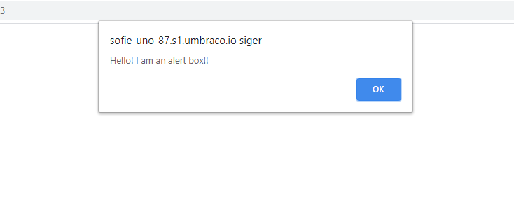
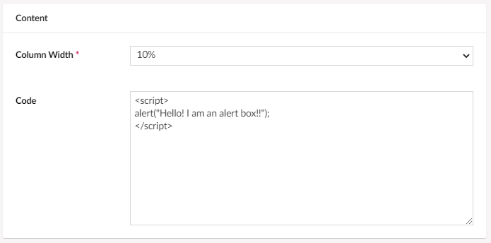

# Code

With the code widget you can inject custom HTML or Javascript in to a specific page on your Umbraco Uno website.

When you need a certain script to run on a specific page on your website, you can use the code widget to inject the code without it affecting the rest of the content. This also provides a way to add custom code to your website without having to access the files.

## Sample

The image above shows a JS alert which pops up whenever someone visits the page. This alert is added using the code widget. See the section below, for configuration options.

## Configuration options

- Column Width
- Code
