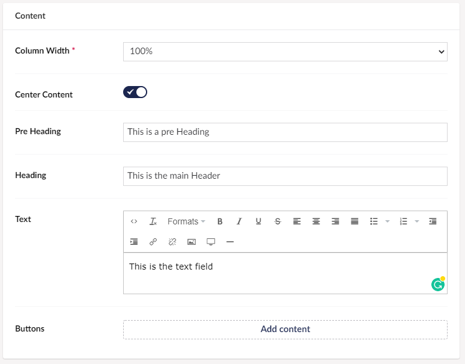

# Header

The Header is a feature that lets you make a header element in your grid. A header element works as a title for the page, in this case a title for the elements you choose to add under it in the grid.

## Sample

## Configuration options

For the grid widgets, you will have the configurable settings if you hover over the preview of your grid and then click the small cog in the top right corner. When in the menu click the widget you want to change the settings for.

- Column Width (This is mandatory because it decides how large the column containing the header is)
- Center Content (Decide whether your content is centered in the column or not)
- Pre Heading (This option lets you make a text above the main heading)
- Heading (This is the main heading)
- Text (This option let you create a text field under your heading)
- [Buttons](../../Buttons/index.md) (This final option let you create buttons)
