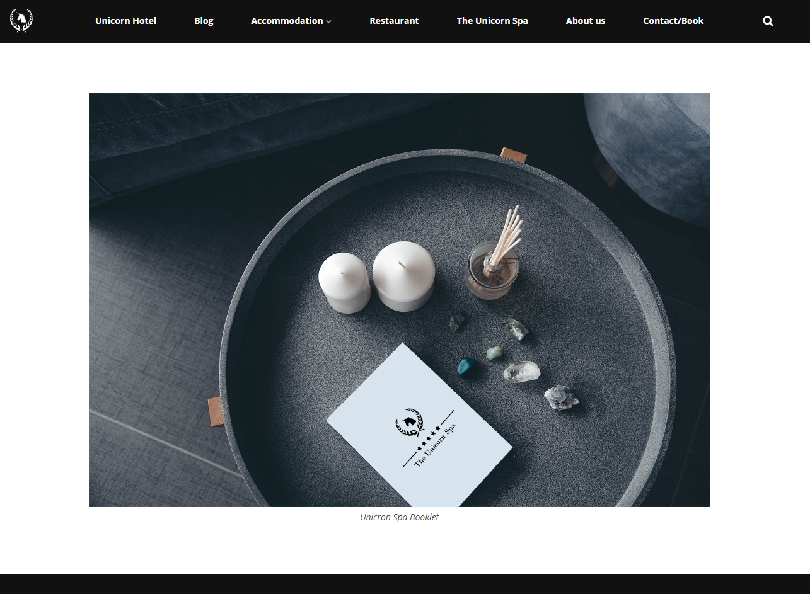
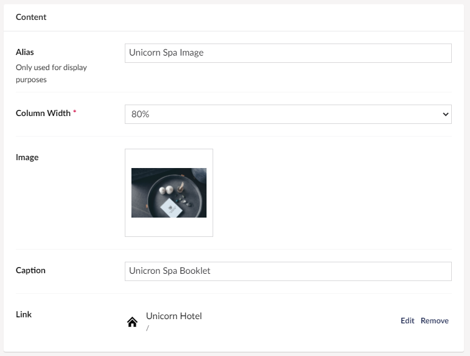

# Image

This will allow you to add an image to your grid. It's possible to add a link and a caption to the image.

## Sample

Below is a sample of an image added to a grid.

## Configuration options

Below is an overview of the various configuration options you have when adding images to your grid.

- Column Width
- Image
- Caption
- Link
