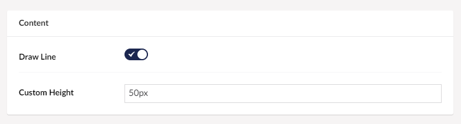

# Line Break

The Line Break is a very useful tool, that allows you to create a space between your columns and to ensure that the next column starts in a new row.

## Sample

## Configuration options

### Content

- Draw Line (This will add a line that will separate the column above from the column below)

- Custom Height (This allows you to decide how much space there should be between the columns)
