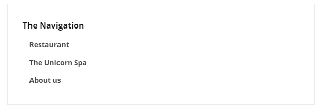

# Navigation

Navigation is a tool that allows you to create a menu, that links to your other pages. You can create a header for the navigation menu, followed by a list of links.

## Sample

## Configuration options

In the links section add the pages you want to add to the navigation box.

### Content

- Column Width
- Heading
- Links - This allows you to add the links that the field adds navigation to.
- Levels of Children - This will allow you to add links under one of the existing links.
- Only Render Children -This will make it so that only the child links appear.
- Boxed Column
