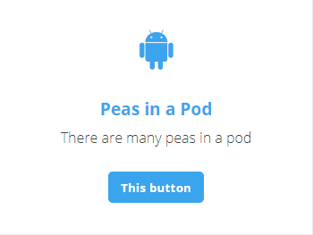
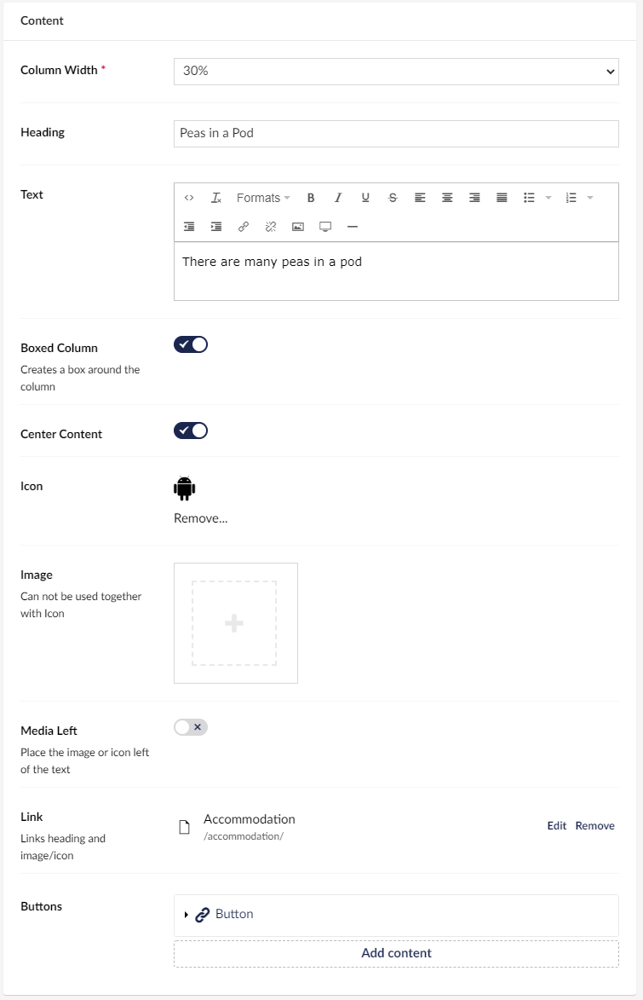

# Pod

The Pod will allow you to create a container of content, containing a header, text, an icon, and a button.
You can also add a link and a background image.

## Sample

## Configuration options

For the grid widgets, you will have the configurable settings if you hover over the preview of your grid and then click the small cog in the top right corner. When in the menu click the widget you want to change the settings for.

- Column Width
- Heading
- Text
- Boxed Column
- Center Content
- Icon
- Image
- Pod Media Left - This will allow you to let the image and icon float to the left of your text.
- Link
- [Buttons](../../Buttons/index.md)
