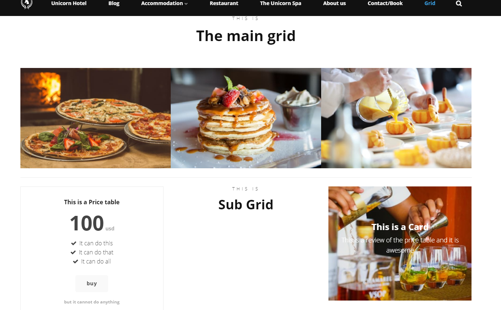

# Sub Grid

The Sub Grid, adds another grid within the original grid. You have the same options in a sub grid as you have in the regular grid.

## Sample

## Configuration options

You add items to a sub grid exactly like you would add them to the regular grid. It is a grid within a grid so the settings for a sub grid is the same as for a regular grid.

### Content

- Column Width - The Sub grid is one of the only grid widgets that do not require you to fill out Column Width.
- Alias
- Columns - This is where you select what your Sub grid needs to contain various other grid widgets.
