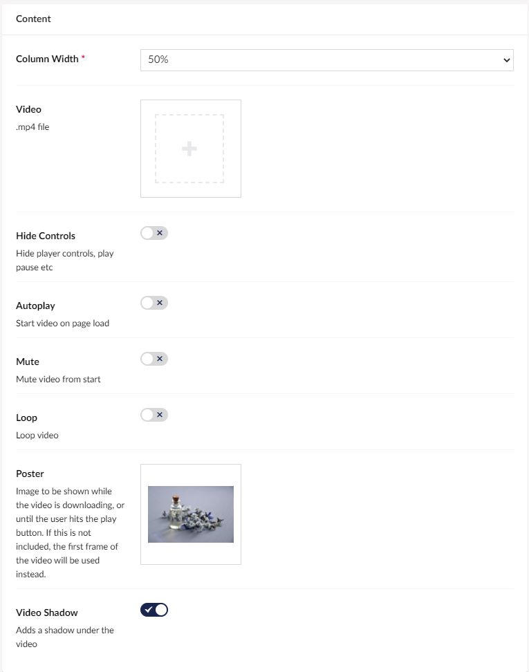

# Video

If you want a video on your site you will want to use the Video widget inside a grid. This lets you upload an MP4 file, with various options such as autoplay or loop.

## Sample

## Configuration options

For the grid widgets, you will have the configurable settings if you hover over the preview of your grid and then click the small cog in the top right corner. When in the menu click the widget you want to change the settings for.

- Column Width (This is mandatory because it decides how large the column containing the Video is)
- Video (This lets you upload the MP4 file containing the video)
- Hide Controls (This slider lets you choose whether the user should be able to control the played video if you turn it on the user cant see the options to pause)
- Auto Play (If you turn this option on the video will autoplay when the user enters the site)
- Mute (If you turn this option on the player will be muted as default)
- Loop (This option will loop the video if turned on)
- Poster (This is an image that is shown until the video is loaded or the user press play if there is no poster selected this will display the first frame of the video)
- Video Shadow (If turned on This will create a shadow under the video frame)
