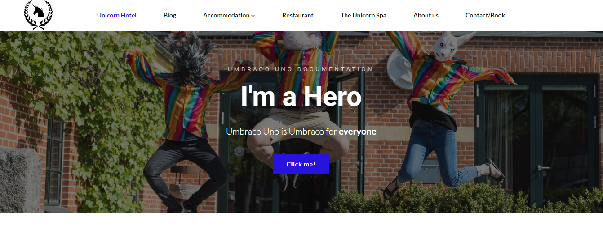
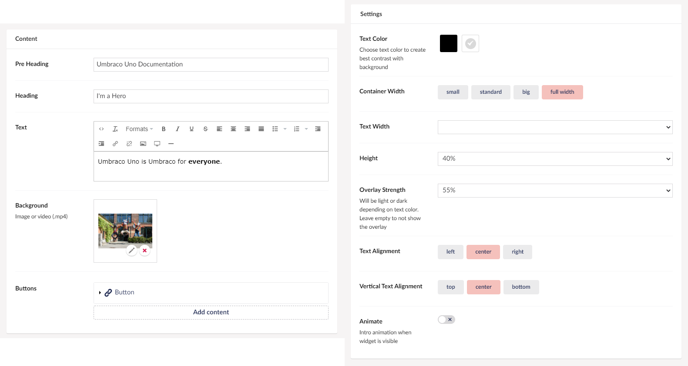

# Hero widget

The Hero widget allows you to create large, full-width elements on your website. The widget includes 2 types of headings, a Rich Text Editor and the option add one or more buttons.

This widget is ideal for content on your homepage or more primary landing pages.

## Sample

Below you can see an example of how a Hero widget might look. This contains the *Pre Heading*, *Heading*, *Text* and a *Button*.

## Configuration Options

You will have a lot of settings for your Hero widget, letting you customize the widget to your liking.

### Content

- Pre Heading
- Heading
- Text (Rich Text Editor)
- Background (image or video)
- [Buttons](../Buttons/index.md)

### Settings

- Text Color (dark or light)
- Container width
- Text Width
- Height (percentage of screen height)
- Overlay Strenght
- Text Alignment
- Vertical Text Alignment
- Animate
