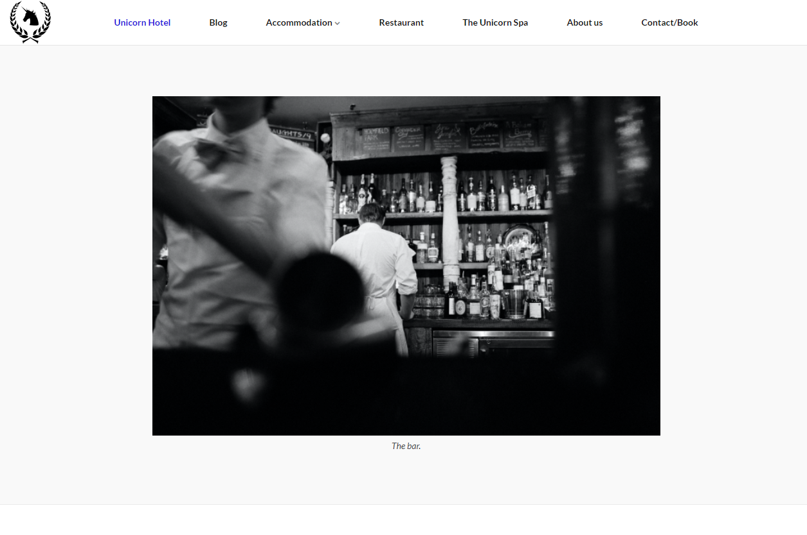
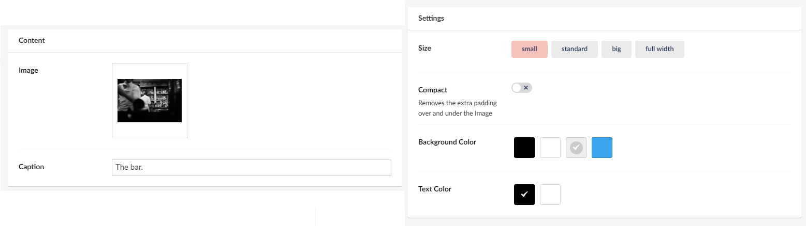

# Image

This widget allows you to add an image to your site. You can choose between multiple sizes, set a caption and select a background color.

Like the Text widget, the Image widget is good if you want an image outside of any of the other widgets that contain the ability to add images.

## Sample

Below is an example of a *small* image with the caption: "The bar.".

## Configuration Options

The Image widget comes with a set of configurable settings.

### Content

- Image
- Caption

### Settings

- Size
- Compact
- Background Color
- Text Color (for the caption)
