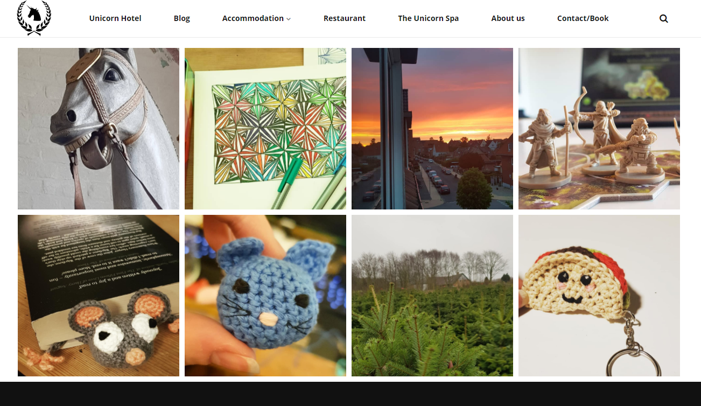
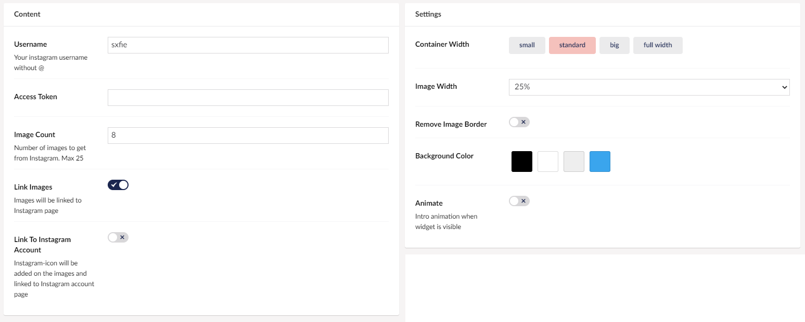

# Instagram widget

With the Instagram widget you can add more branding to your website by displaying a set of posts from your Instagram profile.

In order for this widget to work properly, you will need to configure a set of Instagram related settings on the [General settings](../Uno-pedia/Settings/General-Settings) page.

## Sample

Here's how it looks when displaying 8 pictures from an Instagram account on an Umbraco Uno website.

## Configuration Options

Below is an overview of how the various settings are configured for the sample above. Note that the access token has been removed from the example for security reasons.

### Content

* Username
* Access Token
* Image Count
* Link Images
* Link To Instagram Account

### Settings

* Container width
* Image Width (controls the overall look of the grid of images)
* Remove Image Border
* Background Color
* Animate
