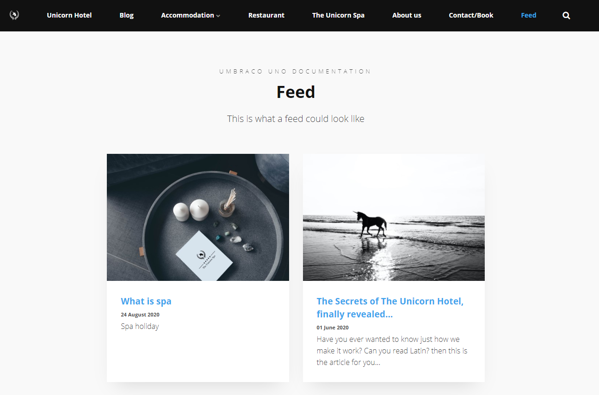
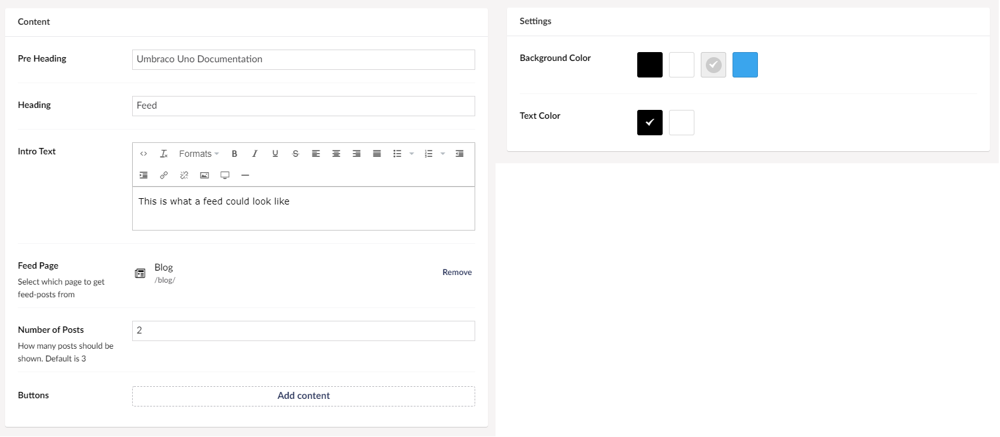

# Latest from feed

The Latest From Feed widget is used to show posts from a **Feed** that you already have on your website. **Feed** here referring to the **Feed** content type.

Let us say that you want to have a blog on your page to share all your latest articles. A feed would be perfect for this because a feed will let you have article thumbnails on this page, and by clicking those, you will be taken straight to the article of your choice.

After the feed has been set-up, it will automatically add any new blog posts to the feed whenever you create a new one. Learn more about how to set up a blog on your website in the [How to set up a Blog](../../Creating-Content/How-to-Set-up-a-Blog-with-a-Feed) article.

## Sample

## Configuration Options

There will be a few options for you to make you feed work the way you want it to work.

### Content

- Pre Header - text above the Heading.
- Heading
- Intro box, lets you give the reader a short intro text to what the articles in the feed is about.
- Feed Page, where you pick which feed you want displayed
- Number Of Posts, gives you the option to select the amount of posts the widget will show
- [Buttons](../Buttons/index.md)

### Settings

- Background Color
- Text Color
