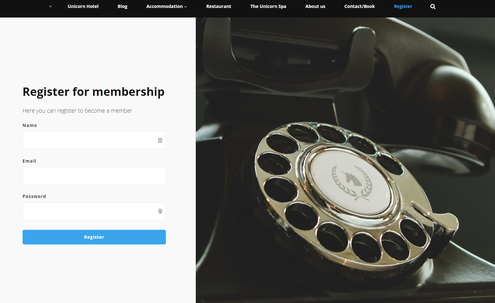
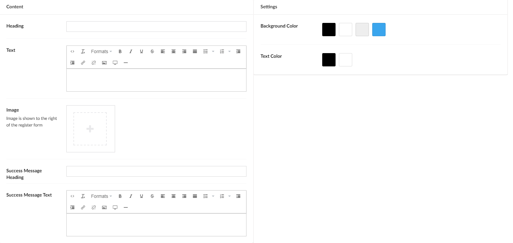
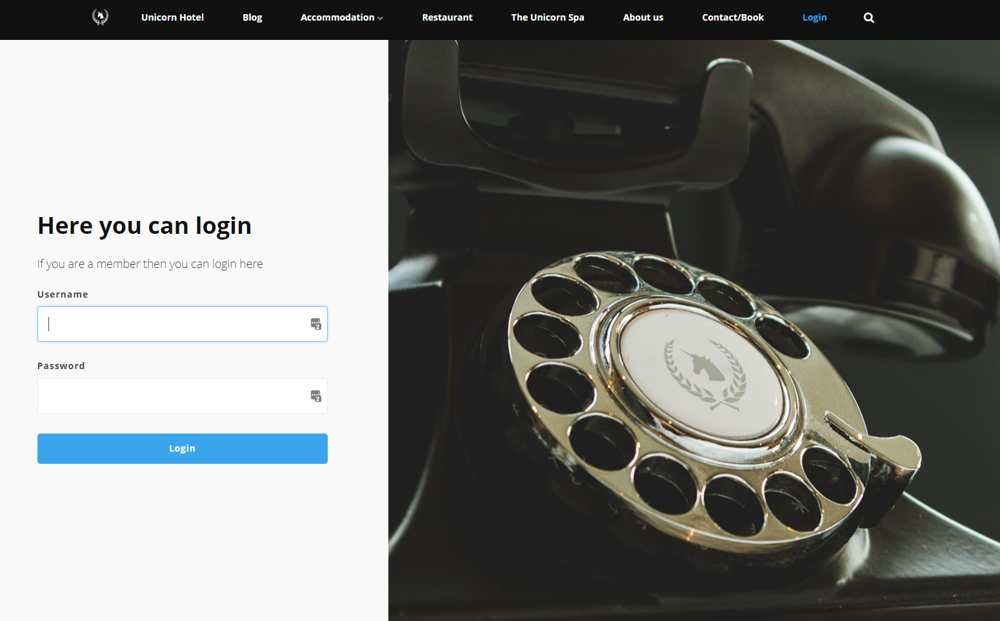
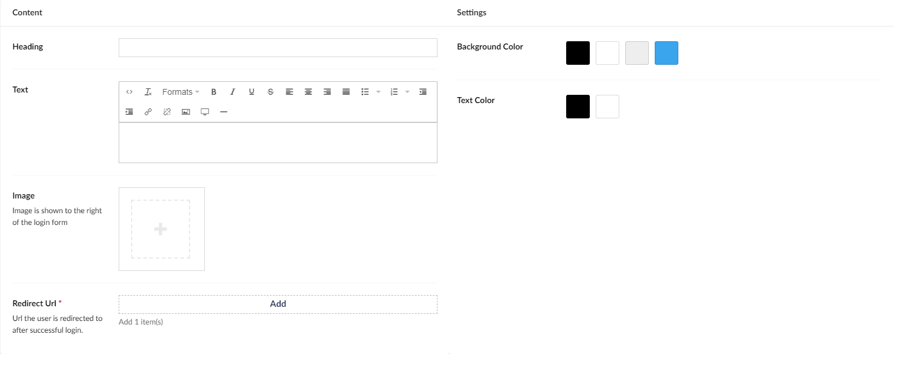

# Login and Register

Umbraco Uno offers a couple of widgets to setup member registration and access. This article presents an overview of the two widgets, Register and Login. To learn more about how to set-up and restrict member access on an Umbraco Uno website, read the [Members](../../Manage-users/Members/) article.

If you want to be able to have members on your page then setting up register and login widgets are your best option. The register widget will let you have a page where the visitors of your page can register for an account. With the Login widget you can create a page where they can login with their account.

## Register

This widget lets you create an element on your page, where people can register for an account on your website.
They will register by filling out the fields, which are Name, Email, and Password, and finalizing by pressing the Register [buttons](../Buttons/index.md). After doing that they will get a message saying that their sign up was successful.

In the backoffice, you will be able to see your registered members by clicking onto the Members tab. Here you can edit members and view how many members you have.

### Sample

### Configuration Options

You will have a couple of options to make the registration window look how you want it to look.

#### Content

- Header
- Text
- Image
- Success Message Heading (This is the heading of the message that displays after a member has successfully been created)
- Success Message Text (This is the message that displays after a member has successfully been created)

#### Settings

- Background Color
- Text Color

## Login

The Login widget allows the member that was created, using The Register widget to login to their account.

It is worth noting that The Login widget, also works for members that were created by the admins in the backoffice.

### Sample

### Configuration Options

You will have some options to choose from when you set up your login widget, such as the background and text color.

#### Content

- Heading
- Text
- Image
- Redirect URL (This is where you decide where the members are redirected to after they log in)

#### Settings

- Background Color
- Text Color

:::note
When the Login widget is added to a page, whenever that page is loaded it will default to show the login form.

This means that even if the Login widget is added as the bottom widget on a page, the frontend will be automatically be *scrolled* down to show the login form as the first thing.
:::
