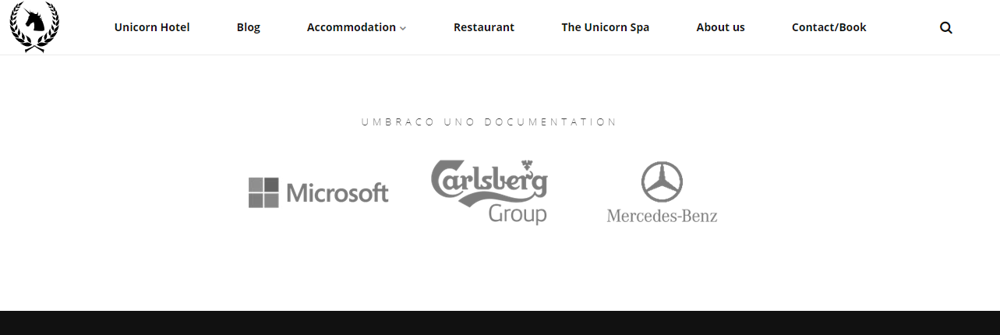
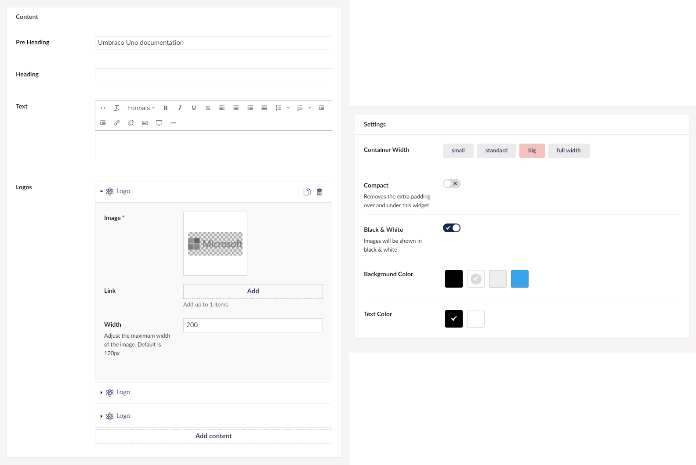

# Logos

The Logos widget lets you add a set of logos to your website. You can choose what images you will use for logos, and what pages they need to link to.

The widget also includes the option to add a Pre Heading, a Heading and more text if needed.

Use this widget when you want to reference or highlight your partners or special cases your company has worked with or for.

## Sample

## Configuration Options

### Content

- Pre Heading
- Heading
- Text
- Logos

You can add multiple logos, and for each there is a set of configuration options:

- Image
- (Optional) Link
- Width (default: 120px)

### Settings

- Container Width
- Compact (removes the extra padding over and under this widget)
- Black & White (images will be shown in black & white)
- Background Color
- Text Color
