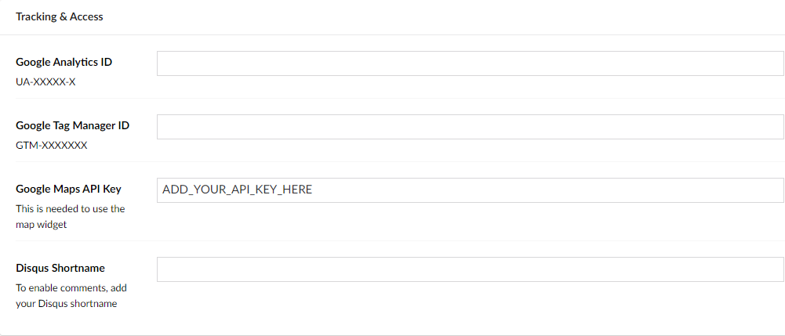
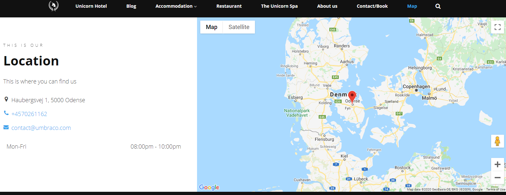
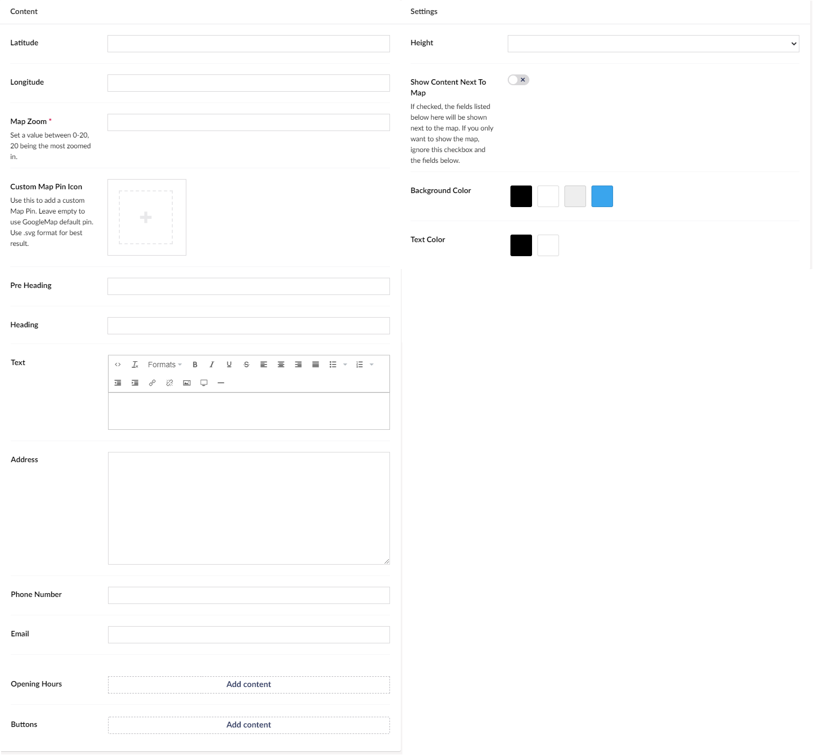

# Map (Google)

The Map widget is a feature that lets you use Google Maps to show the location of your choice. This could be if you need to show where your company is located.

The map widget is a handy widget for this as it will display a map, and if you choose to, then the information can be displayed next to the map. The map will have a pointer set to the **Latitude** and **Longitude** of your choice.

The way it works is that you type in the **Latitude** and **Longitude** and select how zoomed in you want the map to be on a scale from 0 - 20 it is recommended to set it to 7.

## API key settings

Your maps widget might say something like "Oops! Something went wrong." or "for development purposes only". This means that you're missing a Google Maps API key. 

Every Uno project comes with an API key by default, however, if you would like to use your own, follow the instruction in [Google's Documentation](https://developers.google.com/maps/gmp-get-started).

:::note
The API key we provide for all newly created Uno projects works only on the alias.s1.umbraco.io domain.

It will not work on a custom hostname that you've added to the project. In order for Google Maps to work there, you need to use your own Google Maps API key.
:::

Once you have the API key, you need to add it in the "Tracking & Access" group of the "General" settings page found under "Settings". Learn more about the [General settings in the Uno-pedia](../../Uno-Pedia/Settings/General-Settings/).

## Sample

When **Show Content Next To Map** is disabled the white section on the left will not appear and the map will take up all the space.

## Configuration Options

There are quite a few options to make your map work and look the best possible, you will, for example, be able to choose how zoomed in it needs to be.

### Content

- Custom Map Pin Icon
- Pre Heading
- Heading
- Text
- Address
- Phone Number
- Email
- Opening Hours
- [Buttons](../Buttons/index.md)

### Settings

- Height
- Show Content Next To Map
- Background Color
- Text Color
