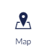
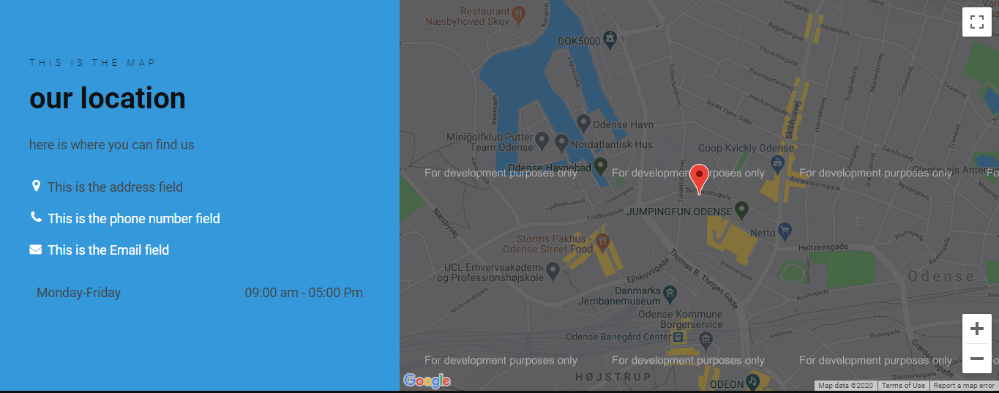

# Map (Google)

The Map Widget is a feature that lets you use Google Maps to show the location of your choice, this could be if you need to show where your company is located.

The way it works is that you type in the ***Latitude*** and ***Longitude*** and select how zoomed in you want the map to be on a scale from 0 - 20 with 7 being default.

## Sample

When ***Show Content Next To Map*** is disabled the blue section on the left will not appear and the map will take up all the space.

## Content

- Custom Map Pin Icon
- Pre Heading
- Heading
- Text
- Address
- Phone Number
- Email
- Opening Hours
- Buttons

### Settings

- Height
- Show Content Next To Map
- Background Color
- Text Color

