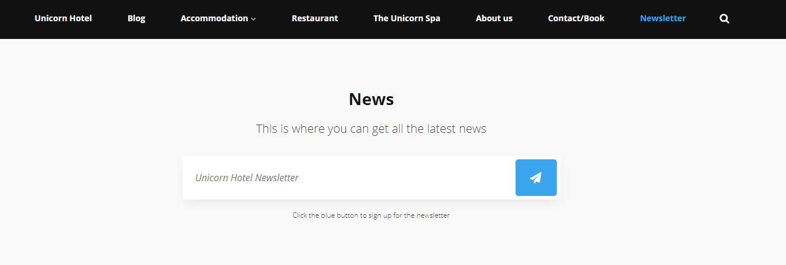
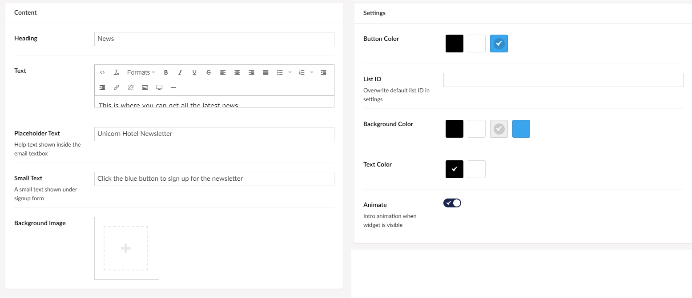

# Newsletter

The Newsletter Widget lets you create a sign-up form for your newsletter.

The way this widget works is that you configure your Mailchimp or Campaign Monitor accounts, then you add your API key and set the ID for the list that the user will be subscribed to.

You can setup all this in the [General Settings](../../Uno-pedia/Settings/General-Settings/index.md#newsletter) page.

The newsletter widget allows people who visit your page to type in their email in the sign-up box after which they will receive a newsletter whenever you send one.

## Sample

## Configuration Options

Setting up the newsletter sign-up box to your liking, can be done through the various options in content and settings.

### Content

- Heading
- Text
- Placeholder Text
- Small Text
- Background Image

### Settings

- Button Color
- List ID
- Background Color
- Text Color
- Animate
