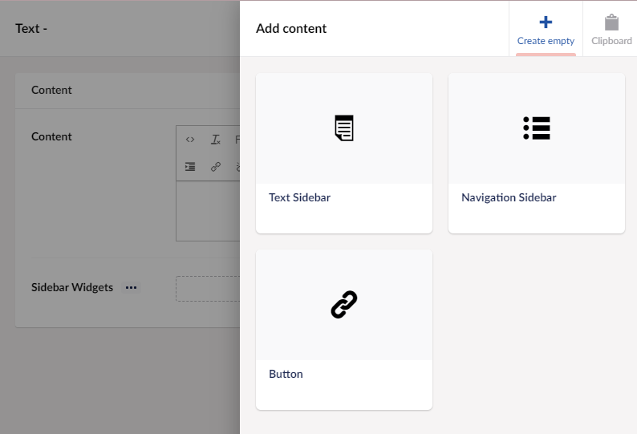
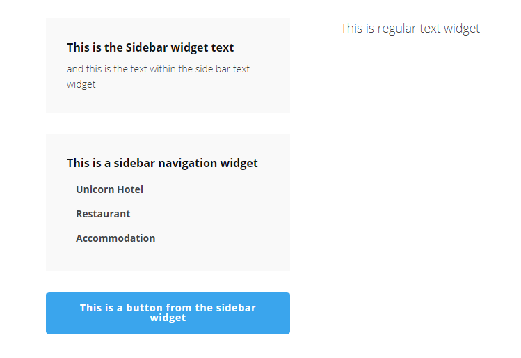
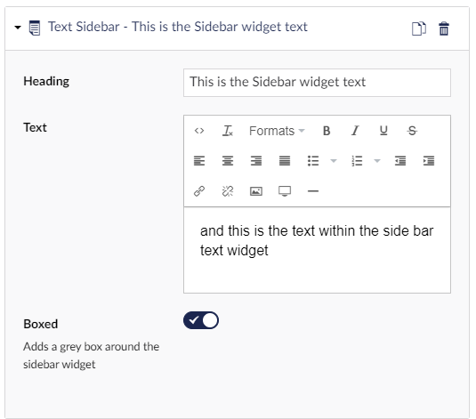
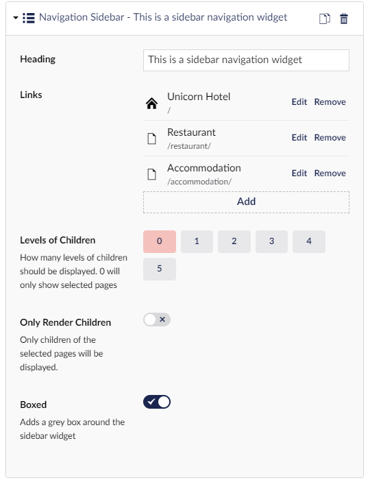

# Sidebar widgets

Some widgets in Umbraco Uno provides the option to create more widgets. This is the case with the Text widget, which has the option to add one or more *sidebar widgets*.

## Sample

* Text (heading and text)
* Navigation (external or internal links, with option to include child/sub pages)
* Button (learn more about the various option in the [Buttons widget](../Buttons) article)

## Configuration options

### Text

* Heading
* Text
* Boxed (puts content in a grey box)

### Navigation

* Heading
* Links (external or internal)
* Levels of Children (number of sub pages visible)
* Only render Children (option to only show sub pages)
* Boxed (puts content in a grey box)

### [Button](../Buttons/index.md)
