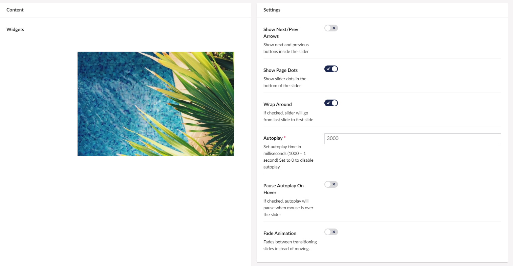

# Slider

The Slider widget allows you to pick 1 or more widgets to display in a slideshow.

This could be used to promote multiple events, by adding an image to the slider with a text about the events.

## Sample

## Configuration options

There is rich opportunity to set up a slider exactly how you want it by using the various options you have here.

### Content

In the content section here you choose what widgets you want the slider to slide through.

### Settings

- Show Next/Prev Arrows - Decide whether you want the slider to have arrows on the edges which takes you through the slides.
- Show Page Dots - in the buttom to show what slide you are currently on.
- Wrap Around - Choose to have the slider **Wrap Around** to make it loop between the widgets indefinitely.  
- Autoplay - Choose how fast the transition between widgets is. Note that 1000 is equal to 1 second.
- Pause Autoplay On Hover - Make the slider pause when you hover over it.
- Fade Animation - Make the transition between slides more seamless by using **Fade Animation**.

:::note
For the best experience with the Slider widget, we recommend adding multiple **Image widgets** containing one image each.
:::
