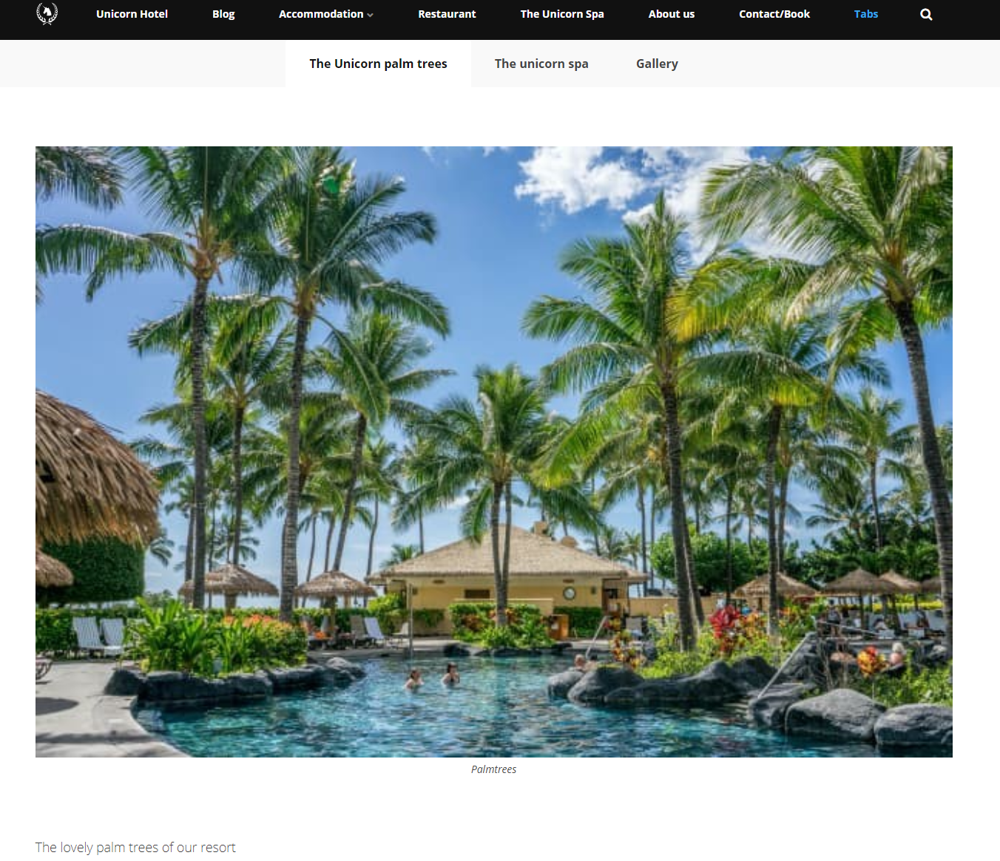

# Tabs

The Tabs widget allows you to create tabs like the ones you find in your browser. Each tab can contain any widgets you desire.
You can even add multiple widgets within one ***Tabs widget***. This means you could have the ***Text widget*** and the ***Image widget*** on one tab and a ***Forms widget*** on another tab.

## Sample

## Configuration options

In the tabs widget, you dont have a lot of options in the settings tab, this is because your configuration will be individual for each tab you add to the tab and as such you will have to set them up individually for each item.
You can get to the configurations options for each item by hovering over the item row and then clicking the cog that will appear.

### Settings

- Theme Color