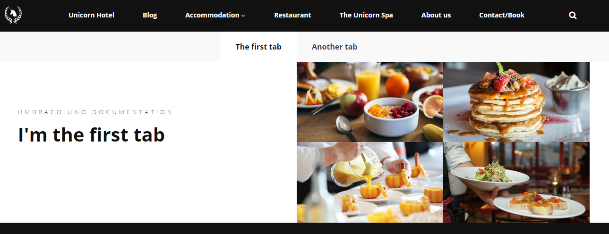
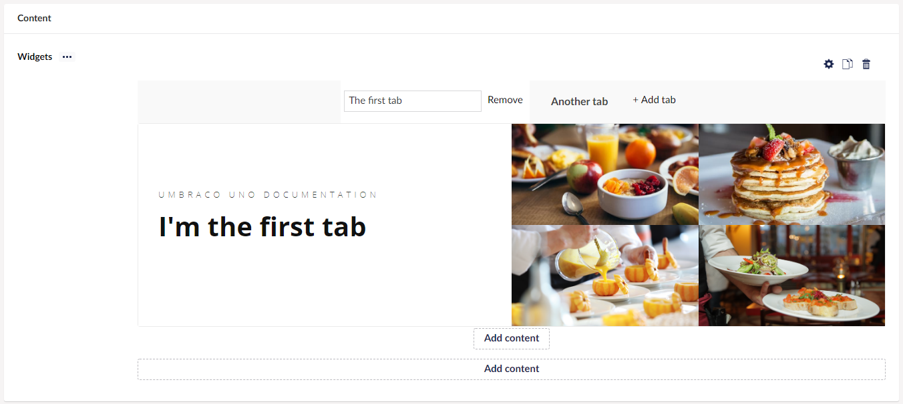
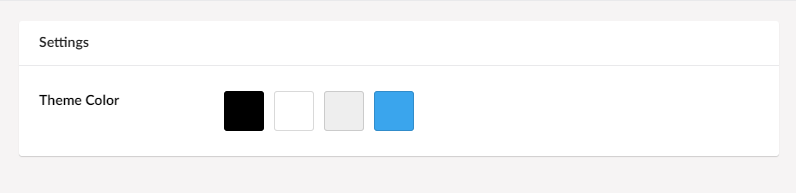

# Tabs

The Tabs widget allows you to create tabs like the ones you find in your browser. Each tab can contain any and as many widgets as you need.

You can even add multiple widgets within one tab. This means you could have the Text widget and the Image widget on one tab and a Forms widget on another tab.

## Sample

The sample below contains two tabs, where the Text and Images widget is used on the first tab, which is displayed on the image.

## Configuration options

Once you have added the tabs widget you can manage your tabs directly from the content workspace.

Create new tabs by selecting "+ Add tab", and remove existing tabs by selecting "Remove". You can also rearrange the order of the tabs by dragging them along the horizonal line.

The tabs widget comes with a single configuration option in the Settings section, which you can access by click the cog wheel. It is showcased below.

### Settings

- Theme Color
