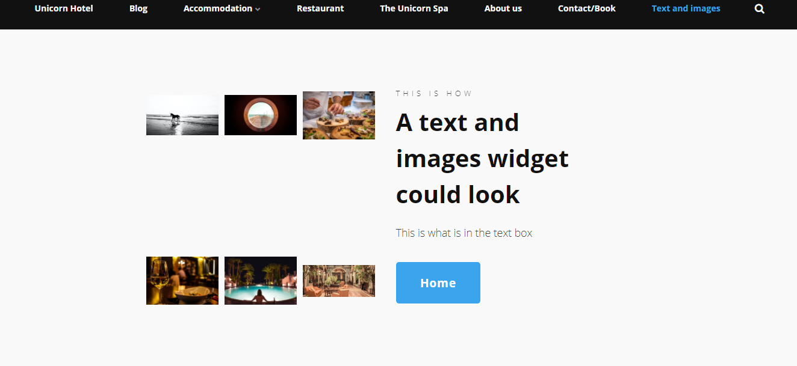
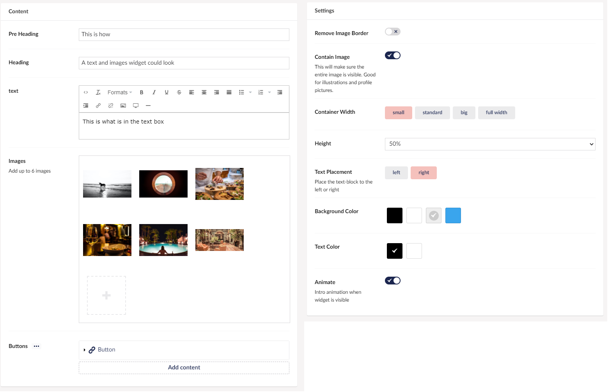

# Text and images

This Widget allows you to create a collage of images and text.
You can have 6 images in total, and you can add a **Pre Heading** and a **Heading** to it.

An example could be that you had an event so the event text would be on the right side, with some of the images on the left, the link button could then link to the full gallery.

## Sample

## Configuration Options

In these configurations, you will have a lot of options to customize both text and images.

### Content

- Pre Heading
- Heading
- Text
- Images
- [Buttons](../Buttons/index.md)

### Settings

- Remove Image Borders
- Contain Image
- Container Width
- Height
- Text Placement
- Background Color
- Text Color
- Animate
