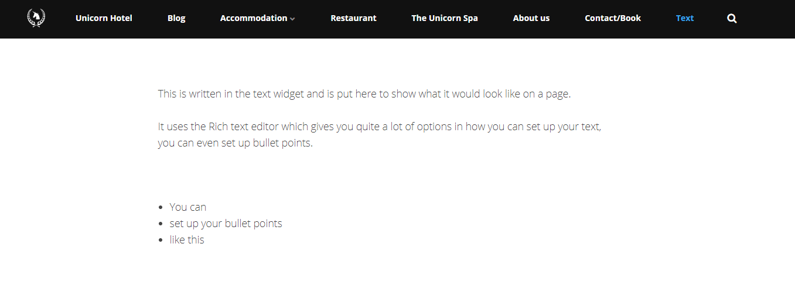
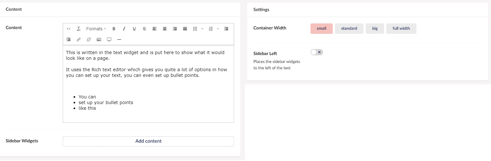

# Text widget

The Text widget lets you create a text field on the page. The widget contains a Rich text editor and the option for adding sidebar widgets, which can be text areas, links and/or buttons. These are explained in more detail in the [Sidebar widgets](../Sidebar-widgets) article.

This widget is useful if you only need to add a text box. Most of the other widgets come with an option to add text as well.

## Sample

## Configuration options

You will have the options to choose the size of your text box and to add a sidebar widget to it.

### Content

- Content (Rich Text Editor)
- Sidebar widgets

### Settings

- Container Width
- Sidebar Left
