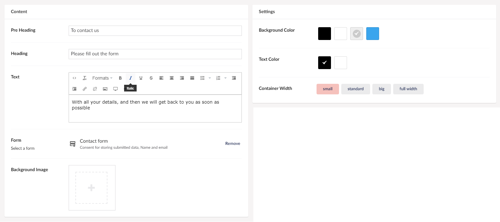

# Umbraco Form

The Umbraco Form widget, gives you the ability to add a custom form to your site. It is important to note that a custom form needs to have been made using Umbraco Forms before this widget can be used.

You can create a form by navigating to the Forms section in the top menu of your backoffice. Learn more about how to create forms in the [Working with Forms](../../Working-with-Forms) section.

## Sample

## Configuration options

You will have multiple options to customize your form, and choose which form should be displayed on your page.

### Content

- Pre Heading
- Heading
- Text
- Background Image
- Form (this is where you add the form that you have already created)

### Settings

- Background Color
- Text Color
- Container Width
