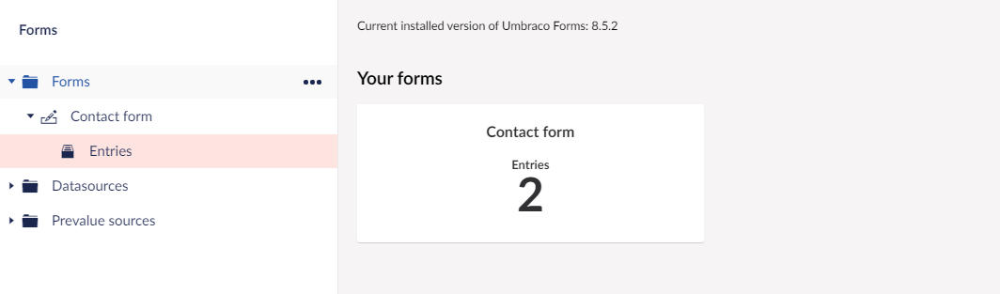
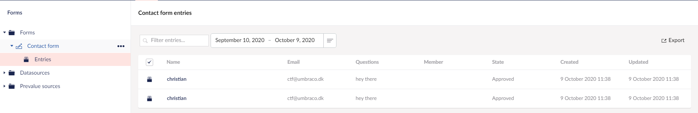

# How to check your form replies

Suppose you have a form on your frontend, and you want to check if you got some replies to your form. In this article, you will learn how you can find and view these replies.
What you will want to do is:

* Go to the Forms section in the backoffice.
* Then in the big window located in the middle of the screen, a box will show you how many replies you have.
* Clicking this box will bring you to an overview of all the replies, and you can click the name of the reply to get into each of them to see them filled out.

If you have more than one form, there will be a box for each of the forms. If you have more than four forms, you will have the option to ***show all*** as only four will be shown as default. 

You can also click the forms in the tree to see the entries for each of the forms.

Next article is about [How you can add Recaptcha](../Recaptcha) to your forms.
