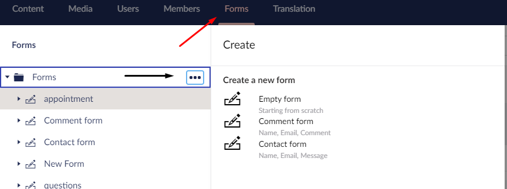
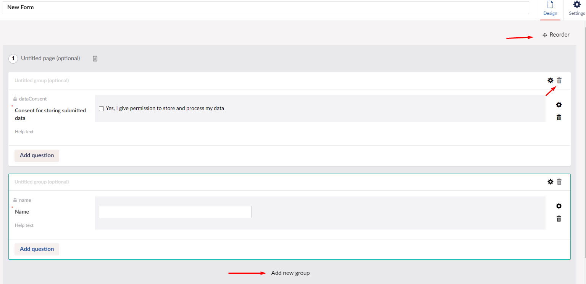
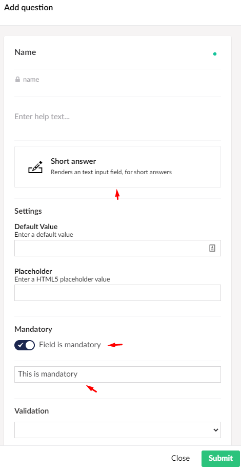

# Setting up a form

In this guide, you will learn how to set up a form in the Umbraco Uno backoffice. 

When you get your Uno project, it will not have any forms, so you will have to make them yourself. In this guide, you will learn how to build a form from scratch.

* Navigate to the Forms section in the backoffice.
* In the tree on the left, hover ***Forms*** and select the ***...***
* On the list that shows up, select "Empty form."

:::Tip
If this is your first form, you will have a green button in the middle of the screen that says ***Create form***.
:::

## Building the form

Now we have taken the first step to creating our very own form. In the next steps, we will name the form and add the fields that it needs to contain.

:::note
You will see that the form already contains an item. This is the permission to store data, so if you need this for the form you are creating, you can go ahead and leave that. Otherwise, you can delete it by clicking the bin icon at the top of the field.
:::

* Give the new form a name where it says ***Enter Name***.
* Now to add a group click where it says ***Add new group***.
* Follow up by clicking ***Add Question***.
* Name the first question, "Name" and choose the ***Short Answer*** as the answer type.
* In the settings further down, set it to mandatory and add a text to show if this field is not filled in.
* When that is done, hit the green submit button at the bottom.

## Finalizing the form

You will most likely have more than one item, and they might not be in the order you want. In that case, you will want to rearrange them. This can be done by hitting the ***Reorder*** button and dragging the groups in the order you want.

:::tip
It can be a good idea to name the groups to keep track of what each group does. This can be done by clicking where it says ***Untitled group***.
:::

Now you can go ahead and add what you like to the form, and when you are done, hit save. Once that is done, you will have a new custom made form to add to your widgets.

In the next article you can learn how to add forms to your website by using [the Umbraco Forms widget](../Umbraco-Forms-widget).
