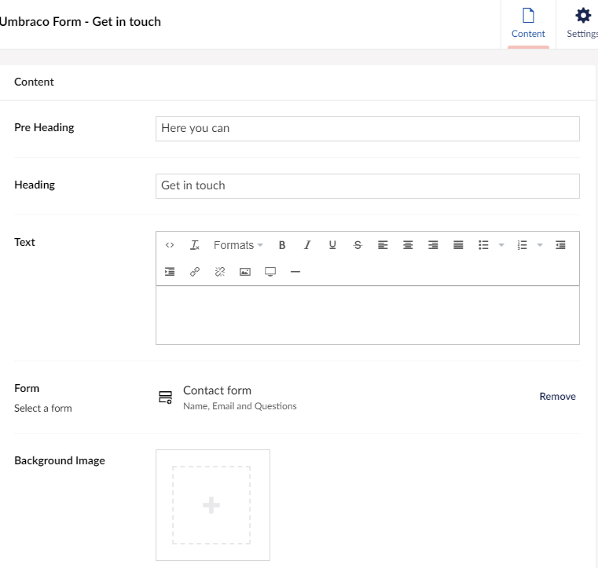
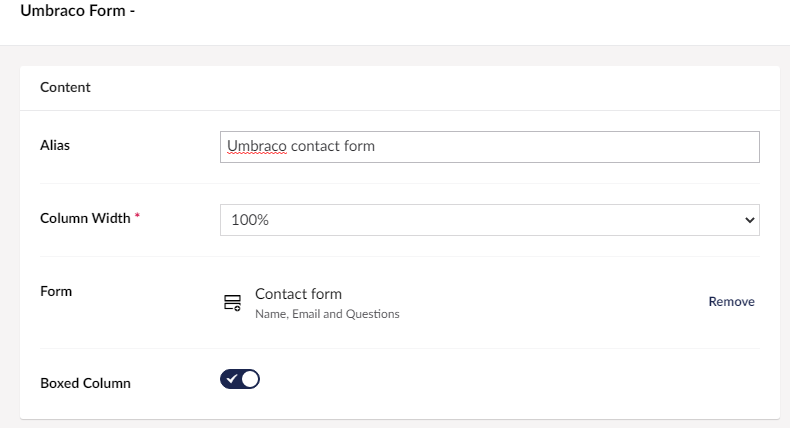

# The Umbraco Forms widget

There are multiple ways of adding a form to your content pages in Umbraco Uno. In this guide, you will learn of two ways to add forms to a site through the use of widgets.

Here is an example of what forms could look like on the front end.

The first option is to add the widget called Umbraco Forms. In this widget, you will get the option to select which form you want to add. You can read about this widget's settings in the article about the [Umbraco Forms widget](../../Widgets/Umbraco-Form).

The second option is to add the form through a Grid widget. The setup here is slightly different than with the Umbraco Forms widget. However, the way you add the form is the same as the first option. Go to the section of the widget that says ***Form*** and then click "Add" to select the form you want.

Now that you know how to add forms the last thing you need to know is [how to check the replies](../Replies).
