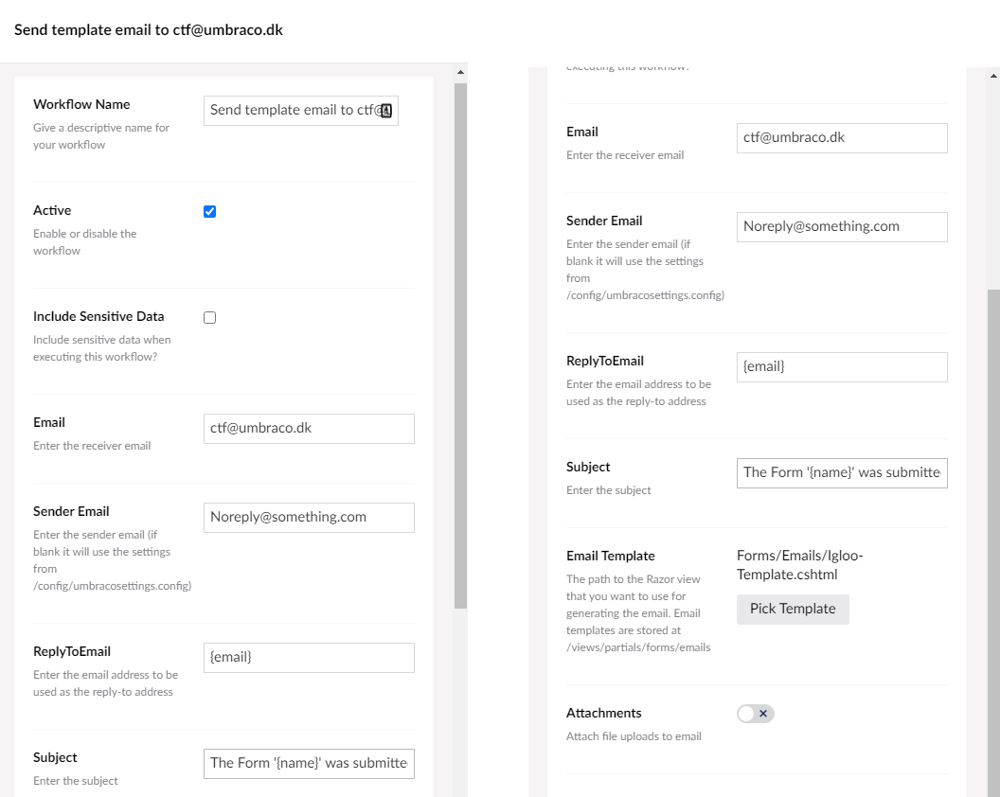

# What is a workflow

A workflow, in this case, is the flow that starts when you press the "submit form" button on the frontend, and ends with the form reply being sent to your email (or wherever you assigned it to arrive)

The most common workflow is to have the user press the submit button, then a thank you message pops up, and then the email is sent to a designated mail inbox. However, you could choose to have it sent to, for example, slack if you wanted. In this guide, you will learn to set-up a basic workflow for your forms.

:::tip
This requires you to have set up a form. If you dont have a form set-up yet, you can learn how to do that in the [Setting up a form](../Setting-up-a-form/index.md) section.
:::

## How do you set up a workflow

In this part, we will learn how to enter the configuration menu for workflows.
We will be working with a form that contains the following:

* A Name field using a short answer
* An Email field using a short answer
* A Question using a long answer

This is how you get into the configuration of your workflow:

1. In the Forms section of the backoffice.
2. Here, select the form you want to add a workflow to.
3. In the bottom of the page, you will find a section containing a checkmark saying ***on submit***
4. Click ***Configure workflow ***
5. The pop op window will contain the workflow that currently exists
6. Select the one that says *Sending template email to*

### Filling in the Workflow

In this section, we will make the workflow send to your email of choice. Please note that this is for a workflow that contains a template. To set up the one without a template, it is the same except the 8th step.

1. Workflow Name - give the workflow the name you want
2. Active - make sure this is checked because it enables/disables the workflow.
3. Include Sensitive Data - Set this depending on if you want sensitive data or not.
4. Email - set this to the email where you want the replies to the form sent to.
5. Sender Email - This should be something like Noreply@something.com.
6. ReplyToEmail- here, you can add this {email}. It will take what the customer answered in the field called email.
7. Subject - this is going to be the subject of the email you receive from the website.
8. Template - as a standard, make sure this is set to ***Igloo-template.cshtml***.
9. Attachments - this if you want the email to contain logos or other kinds of attachments.

:::note
The above is for setting up a workflow from scratch. This will be needed if you choose any of the two forms templates coming with the basic install of Umbraco Uno.
:::

If you choose to create a new form without a template, all this has been done for you except the ***Sender Email***, which you will have to fill in yourself.
