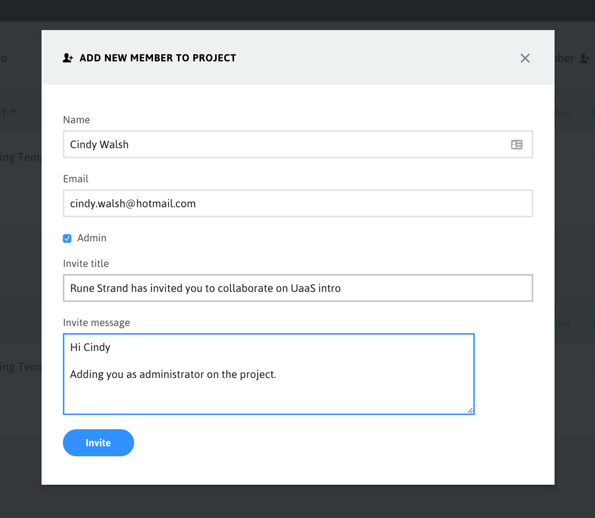

#Team members in the Portal and Umbraco Backoffice users
You can add team members to your projects from the Umbraco as a Service portal and these get automatically added as users in the backoffice of all environments for the project. The users will also be created in local clones of your development site. The same username and password is used to login in all parts of Umbraco as a Service - portal, backoffice, Kudu console.

When adding a team member the default permission will be *Read*. If the *Admin* checkbox is ticked they will be given Admin rights to the project.

##Team member roles
Roles for each environment can be set on the *Edit Team* page available from the *Settings* dropdown.

* Admin: Has access to everything on a Project. An admin can Delete and Rename a Project, and only admins can edit the Team (adding/removing other team members and changing permissions). An admin can deploy using Portal and has access to git.

* Write: A team member with Write permissions can do everything on a Project except Delete, Rename and edit Team. A user with Write permissions is able to Deploy through the Portal and they have access to Development and Staging environments and the git repositories

* Read: A team member with Read permissions can only view the Project in the Portal, and is not able to Deploy or change anything on the Project through the Portal.

**_Important Note:_**
All team members created through the Portal are created as admin users in the backoffice.

In the future:
* Admin users will give you an Admin user in the Umbraco backoffice as well (with access to all sections)
* Team members with Write and Read will give you an Editor user in the Umbraco backoffice with access to Content, Media, Forms and Member sections
