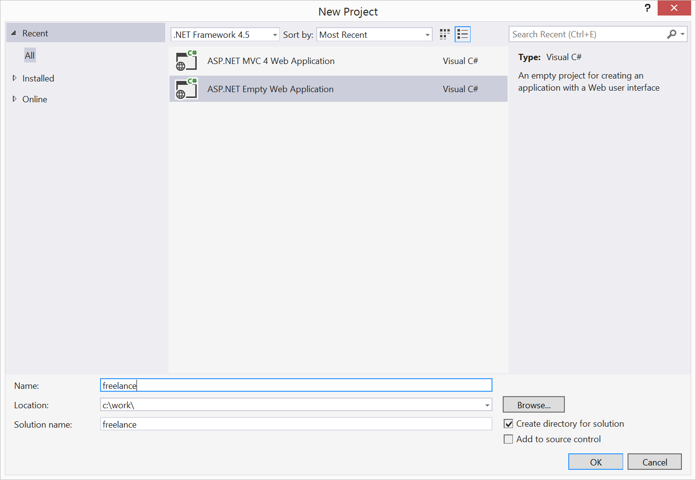

#Working with your site in Visual Studio
Working with your Umbraco as a Service site in Visual Studio is no different than working with any other Umbraco site in Visual Studio. There are a few considerations to take into account when first setting up, but the process of developing Umbraco websites with Visual Studio is identical.

There are two ways to approach working with an Umbraco as a Service project in Visual Studio.

## Web Site
The easiest way is to simply open the cloned project folder as a Web Site in VS.

This approach is great if you are working alone or in a small team and you are comfortable with having your c# code in the `/App_Code/` and `/App_Plugins/` folders. By doing this there is literally nothing to set up. All you have to do is open the folder and you can run the site locally by pressing `Ctrl-F5`.

When you are happy with your changes you simply push them to Umbraco as a Service.

##Project/Solution
If you are more comfortable with working in a solution where you have custom code in a reference project and then build/compile to the web site, there are a few more things to consider.

####The Deployment repository
An important concept in regard to the git repository that is part of your Umbraco as a Service site is that the repository is a *deployment* repository and not a *source code* repository. It is not intended to replace whatever source code repository you currently use (GitHub, BitBucket, etc.).

While you will commit all code except compiled dll's to your source code repository you treat the deployment repository differently in that you commit only the compiled dll's and no source code or project files.

The following will guide you through how to set up and work with an Umbraco as a Service project in a VS solution.

####Create a new project
In Visual Studio create a new project, selecting the Empty Web Application option. If you will be extending Umbraco with your own MVC code (SurfaceControllers, etc.) you can start with the MVC 4 Web Application project type. Note that you'll need to remove some files if you start with this type of project.

####Add Your site files
If you haven't already, clone your development site to your local machine. Make sure you've also restored your content from your Umbraco as a Service site, which will create the local database you'll need to run your site locally. See the [Working Local documentation](../Working-Locally/) for details on how to do this if you haven't already.

- Copy your site files and folders into the project folder you just created
    * Include the /.git folder
- Check the *Show all files* option in Visual Studio
- Include all folders and files your project requires to function when deployed and save. _Note:_ not all folders should be added to the project, as with any other Umbraco project you generally will include:
    * /App_Code
    * /App_Plugins
    * /Config
    * /css
    * /js
    * /Scripts
    * /Views
    * ...and any additional folders that contain files your site will need in order to fully function

####Update .gitignore
You may need to add a few entries to your .gitignore file so they are not deployed to your Umbraco as a Service site. For example, you can add these to your .gitignore file (you may have more to add as well):

    Properties/
    Web.Debug.config
    Web.Release.config
    *.csproj

You should also exclude any folders that contain only source code. Folders such as /Controllers or /Models and any custom code you have are good examples. You should not add the /.git folder if that is an option.

Make sure you then commit your updated .gitignore file to your local Umbraco as a Service repository. It is important that you do not deploy any .csproj (or .vbproj, etc.) files to your site. If you do your site may become unresponsive while the deploy process attempts to parse the file contents.

####Getting Ready to deploy your updates
Now that you've added your own touch to your site, and thoroughly tested of course, you're ready to deploy to your Umbraco as a Service development site. The key thing to remember is that you'll commit anything that is required by your site to the local git repository and will not commit source or project files. That means you'll add .dll files to the repository, which is typically something you wouldn't do with a source code repository.

Once you have everything your site will need commited you can follow the [deployment workflow](../../Deployment/) to complete the deployment.
