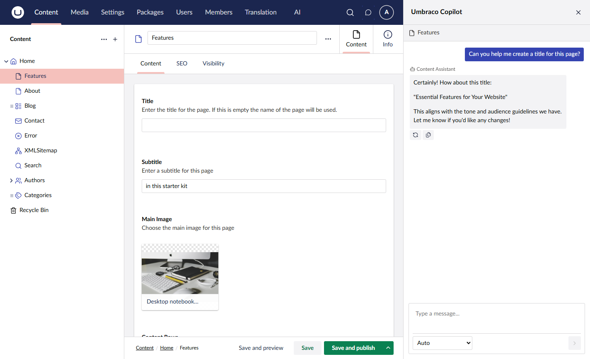
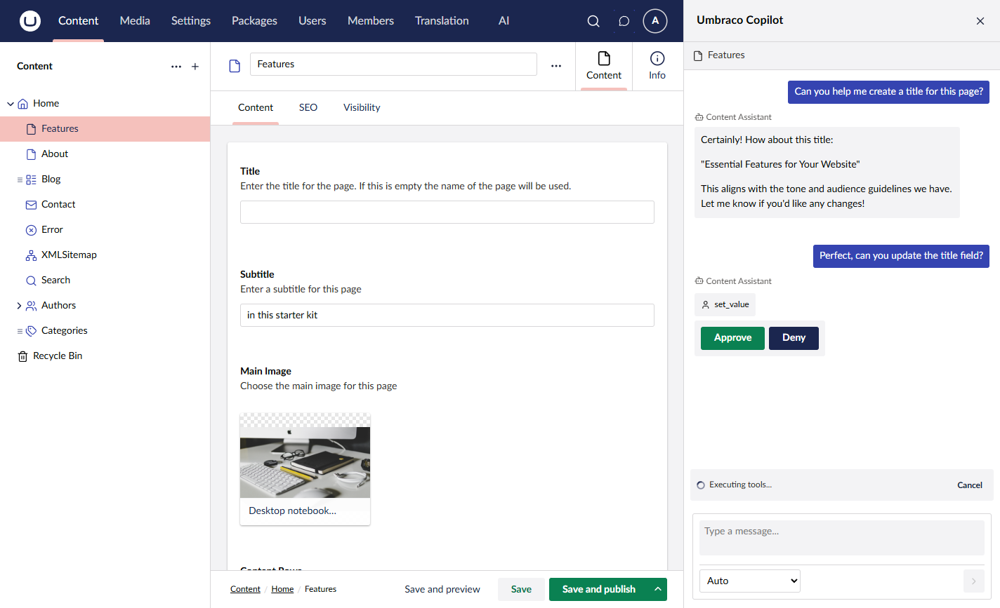

# Copilot

The Copilot is an AI-powered assistant that appears as a sidebar in the Umbraco backoffice. It provides conversational AI capabilities directly within your content editing workflow.

## Overview

```
┌──────────────────────────────────────┬─────────────────────┐
│ Content Editor                       │ AI Copilot         │
│                                      │                     │
│ Page Title: [________________]       │ How can I help?     │
│                                      │                     │
│ Body:                                │ ┌─────────────────┐ │
│ ┌────────────────────────────────┐   │ │ User: Suggest   │ │
│ │ Lorem ipsum dolor sit amet...  │   │ │ a better title  │ │
│ │                                │   │ │ for this page   │ │
│ │                                │   │ ├─────────────────┤ │
│ │                                │   │ │ AI: Here are    │ │
│ │                                │   │ │ some options... │ │
│ └────────────────────────────────┘   │ └─────────────────┘ │
│                                      │                     │
│                                      │ [Type a message...] │
└──────────────────────────────────────┴─────────────────────┘
```

## Accessing the Copilot

The Copilot is available in the **Content** and **Media** sections:

1. Look for the **AI Assistant** button in the header
2. Click to toggle the sidebar open/closed
3. The button shows an active state when the sidebar is open


The Copilot button only appears in sections where it's relevant (Content and Media).




## Features

### Conversational Interface

Chat naturally with the AI assistant:

- Ask questions about your content
- Request suggestions and improvements
- Get help with writing tasks
- Multi-turn conversations maintain context

### Content Awareness

The Copilot understands your current editing context:

- Current content item being edited
- Property values and structure
- Content type information
- Media items and relationships

### Tool Execution

Agents can execute tools to interact with Umbraco:

- Read property values
- Update content fields
- Navigate to related content
- Perform custom actions

### Human-in-the-Loop Approval

For sensitive operations, the Copilot requests confirmation:

```
┌─────────────────────────────────────────┐
│ The AI wants to update the page title   │
│ to "New Improved Title"                 │
│                                         │
│ [Approve] [Deny]                        │
└─────────────────────────────────────────┘
```

The approval workflow ensures editors maintain control over content changes.



## Configuring Copilot Agents

Agents power the Copilot's capabilities. Configure which agent handles Copilot interactions:

### Default Agent

Set a default agent for Copilot in your application:



```csharp
services.Configure<AIAgentOptions>(options =>
{
    options.DefaultCopilotAgentAlias = "content-assistant";
});
```



### Agent Instructions

Configure agent instructions for Copilot behavior:

```
You are an AI assistant helping editors create content in Umbraco.

Your capabilities:
- Suggest improvements to content
- Help with writing and editing
- Answer questions about the current page
- Update properties when asked

Always be helpful and concise.
```

## Auto Mode and Agent Routing

When multiple agents are available on a surface, the Copilot uses "Auto" mode to automatically select the best agent for each user message. This works by sending the user's prompt to a classifier model that picks the most appropriate agent based on each agent's name and description.

### Classifier Profile

By default, the classifier uses the default chat profile, which may be a powerful (and expensive) model. Since classification only returns a single GUID, you can configure a cheaper or faster model specifically for this task:

1. Navigate to the **AI** section > **Settings**
2. Set the **Classifier Chat Profile** to a lightweight model (e.g., GPT-4o Mini, Claude Haiku)
3. Save

See [Settings](../../concepts/settings.md#classifier-chat-profile) for more details on the fallback chain.

## Using the Copilot

### Getting Suggestions

Ask the Copilot for content suggestions:

> "Can you suggest a better headline for this page?"

> "Write a meta description for this article"

> "What improvements would you suggest for SEO?"

### Making Changes

Request content changes through conversation:

> "Update the page title to 'Getting Started Guide'"

> "Add a summary paragraph at the beginning"

> "Translate the body text to French"

The Copilot will request approval before making changes.

### Asking Questions

Get information about your content:

> "What is the current word count?"

> "When was this page last modified?"

> "What images are used on this page?"

## Entity Selector

The Copilot includes an entity selector for targeting specific content:

1. Click the entity selector in the Copilot header
2. Browse or search for content
3. Select the item to set as context
4. The Copilot now operates on that content

The entity selector allows working with content different from what's currently open in the editor.

## Message Actions

Each AI message includes action buttons:

| Action         | Description                        |
| -------------- | ---------------------------------- |
| **Copy**       | Copy the message text to clipboard |
| **Regenerate** | Generate a new response            |

## Status Indicators

The Copilot shows the current agent status:

| Status                | Description                |
| --------------------- | -------------------------- |
| **Ready**             | Agent is waiting for input |
| **Thinking**          | Agent is processing        |
| **Executing**         | Agent is running a tool    |
| **Awaiting Approval** | Needs human confirmation   |

## Troubleshooting

### Copilot Not Appearing

- Verify the Agent add-on is installed
- Check you're in the Content or Media section
- Ensure an agent is configured as the default copilot

### Agent Not Responding

- Verify a default chat profile is configured
- Check the agent has valid instructions
- Review browser console for errors

### Approval Buttons Not Working

- Check browser JavaScript errors
- Verify the approval element is registered
- Ensure the agent is configured for HITL

## Related

- [Agent Runtime](../agent/README.md) - Backend agent functionality
- [Concepts](../agent/concepts.md) - Agent fundamentals
- [Instructions](../agent/instructions.md) - Configuring agent behavior
- [Frontend Tools](frontend-tools.md) - Custom tool integrations
