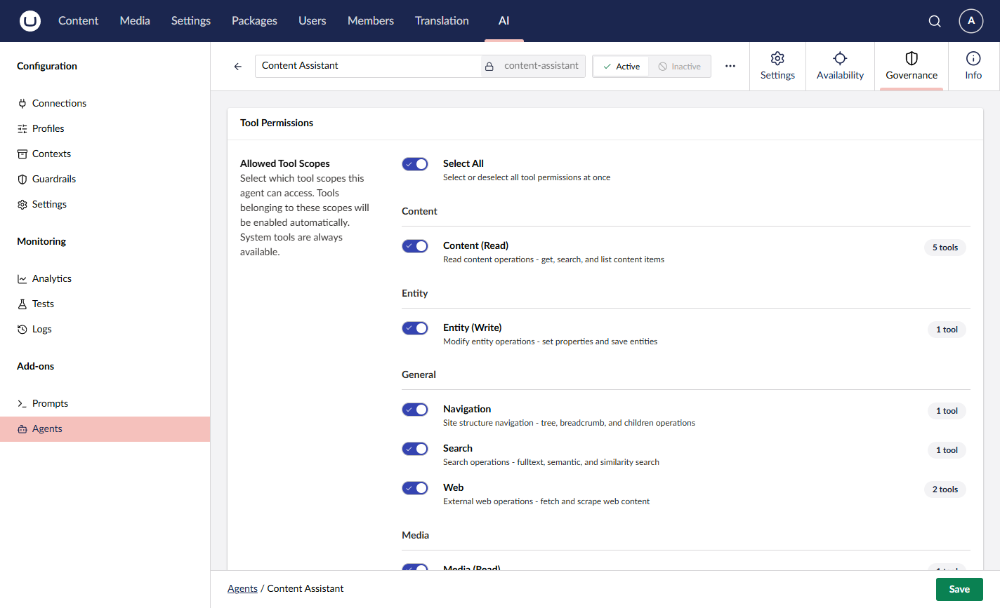

# Agent Tool Permissions

Agent tool permissions control which frontend tools a **standard agent** can execute. This system provides fine-grained security to ensure agents only access appropriate functionality.


Tool permissions apply to **standard agents** only. **Orchestrated agents** manage tools within their [workflow](workflows.md) implementations.


Tool permissions are configured in the **Governance** tab of the agent workspace, alongside [guardrails](../../concepts/guardrails.md).



## Permission System Overview

The permission system operates at three levels:

1. **Tool Scope Permissions** - Grant access to all tools within specific scopes (e.g., "content-read", "navigation")
2. **Explicit Tool Permissions** - Grant access to individual tools by their ID
3. **User Group Overrides** - Customize tool permissions per user group


A tool is **enabled** if it appears in the agent's explicit tool list **OR** if its scope is in the agent's allowed scopes list.


## Tool Scopes

Tool scopes categorize frontend tools by their purpose and security requirements. Each tool can belong to a scope, allowing you to grant access to entire categories of operations at once.

### Built-in Tool Scopes

Umbraco.AI provides built-in scopes for common tool categories:

| Scope ID        | Icon             | Destructive | Description                                         |
| --------------- | ---------------- | ----------- | --------------------------------------------------- |
| `content-read`  | `icon-article`   | No          | Read operations on content items                    |
| `content-write` | `icon-article`   | **Yes**     | Create, update, or delete content                   |
| `media-read`    | `icon-picture`   | No          | Read operations on media items                      |
| `media-write`   | `icon-picture`   | **Yes**     | Upload, update, or delete media                     |
| `search`        | `icon-search`    | No          | Search content, media, and Umbraco resources        |
| `navigation`    | `icon-navigation`| No          | Access current page info and context resources      |
| `web`           | `icon-globe`     | No          | Fetch external web pages and content                |


**Destructive scopes** include tools that can modify or delete data. Exercise caution when granting these permissions.


### Configuring Scope Permissions

Scope permissions can be configured in the **Governance** tab of the agent workspace in the backoffice, or via code:



```csharp
var agent = new AIAgent
{
    Alias = "content-assistant",
    Name = "Content Assistant",
    AllowedToolScopeIds = new List<string> { "content-read", "search", "navigation" },
    Instructions = "You help users find and read content."
};

await _agentService.SaveAgentAsync(agent);
```



## Explicit Tool Permissions

For fine-grained control, you can grant access to specific tools by their ID, regardless of their scope.

### When to Use Explicit Permissions

Use explicit tool permissions when you need to:

- Grant access to a single tool from a scope without enabling the entire scope
- Create custom combinations of tools for specialized agents
- Override scope-based permissions for specific tools

### Configuring Explicit Tool Permissions

Explicit tool permissions can be configured in the **Governance** tab of the agent workspace in the backoffice, or via code:



```csharp
var agent = new AIAgent
{
    Alias = "search-only-agent",
    Name = "Search Only Agent",
    AllowedToolIds = new List<string>
    {
        "search_umbraco",
        "get_page_info"
    },
    Instructions = "You can search content and get page information."
};

await _agentService.SaveAgentAsync(agent);
```



## Combining Scopes and Explicit Permissions

An agent can use both scope-based and explicit permissions together. A tool is enabled if **either** condition is met:



```csharp
var agent = new AIAgent
{
    Alias = "hybrid-agent",
    Name = "Hybrid Agent",
    // Allow all tools in the "content-read" scope
    AllowedToolScopeIds = new List<string> { "content-read" },
    // Plus this specific tool from the "media-write" scope
    AllowedToolIds = new List<string> { "get_umbraco_media_item" },
    Instructions = "You can read content and fetch specific media items."
};
```



In this example, the agent can:
- Execute **all tools** in the `content-read` scope
- Execute the `get_umbraco_media_item` tool specifically

## User Group Permission Overrides

User group overrides allow you to customize an agent's tool permissions for specific user groups. This is useful when different teams need different levels of access.

### Use Cases

- **Content Editors** - Allow `content-write` scope for editors, but only `content-read` for contributors
- **Administrators** - Grant full access to admin users while restricting others
- **Department-Specific** - Customize tools based on organizational structure

### How Overrides Work

1. **Base Permissions** - The agent's `allowedToolScopeIds` and `allowedToolIds` define the default permissions
2. **Override Applied** - When a user from a specific user group runs the agent, their group's override is applied
3. **Override Replaces** - The override **completely replaces** the base permissions for that user group


User group overrides **replace** the agent's base permissions entirely. They do not merge with base permissions.


### Configuring User Group Overrides

User group overrides can be configured in the **Governance** tab of the agent workspace in the backoffice, or via code:



```csharp
var agent = new AIAgent
{
    Alias = "content-agent",
    Name = "Content Agent",
    // Base permissions (applies to users without overrides)
    AllowedToolScopeIds = new List<string> { "content-read" },
    // User group overrides
    UserGroupPermissions = new List<AIAgentUserGroupPermissions>
    {
        new AIAgentUserGroupPermissions
        {
            UserGroupId = editorGroupId,
            AllowedToolScopeIds = new List<string> { "content-read", "content-write" },
            AllowedToolIds = new List<string>()
        },
        new AIAgentUserGroupPermissions
        {
            UserGroupId = contributorGroupId,
            AllowedToolScopeIds = new List<string> { "content-read" },
            AllowedToolIds = new List<string> { "search_umbraco" }
        }
    },
    Instructions = "You help manage content."
};

await _agentService.SaveAgentAsync(agent);
```



### Permission Resolution Flow

When a user runs an agent, permissions are resolved in this order:

```
1. Is the user in any user groups?
   ├─ No  → Use agent's base permissions
   └─ Yes → Continue to step 2

2. Does the user belong to a group with an override?
   ├─ No  → Use agent's base permissions
   └─ Yes → Use the override's permissions (replaces base)

3. Is the tool enabled by the resolved permissions?
   ├─ Tool ID in allowedToolIds? → ✅ Enabled
   ├─ Tool scope in allowedToolScopeIds? → ✅ Enabled
   └─ Otherwise → ❌ Disabled
```

## Frontend Tool Metadata

Frontend tools define their scope and destructiveness using the `ManifestUaiAgentTool` interface:



```typescript
const manifest: ManifestUaiAgentTool = {
    type: "uaiAgentTool",
    alias: "Uai.AgentTool.CreateContent",
    name: "Create Content Tool",
    meta: {
        toolName: "create_content",
        description: "Creates a new content item",
        // Scope for permission grouping
        scope: "content-write",
        // Marks this tool as destructive (creates/modifies data)
        isDestructive: true,
        parameters: {
            type: "object",
            properties: {
                contentType: { type: "string" },
                name: { type: "string" }
            }
        }
    },
    api: () => import("./create-content.api.js")
};
```



### Tool Metadata Properties

| Property        | Type      | Description                                                      |
| --------------- | --------- | ---------------------------------------------------------------- |
| `scope`         | `string?` | Tool scope ID for permission grouping (e.g., "content-write")    |
| `isDestructive` | `boolean` | Whether tool performs destructive operations (create/update/delete) |

This metadata flows from frontend to backend for permission filtering:

```
Frontend Tool Manifest
    ↓ (metadata attached)
UaiFrontendTool { Tool, Scope, IsDestructive }
    ↓ (sent via forwardedProps)
Backend AIFrontendTool { Tool, Scope, IsDestructive }
    ↓ (permission check)
Agent Runtime (filters by permissions)
```

## Checking Permissions Programmatically

### Check if Tool is Enabled



```csharp
public class MyService
{
    private readonly IAIAgentService _agentService;

    public MyService(IAIAgentService agentService)
    {
        _agentService = agentService;
    }

    public async Task<bool> CanAgentUseToolAsync(
        Guid agentId,
        string toolId,
        CancellationToken cancellationToken = default)
    {
        var agent = await _agentService.GetAgentAsync(agentId, cancellationToken);
        if (agent == null) return false;

        return await _agentService.IsToolEnabledAsync(
            agent,
            toolId,
            userGroupIds: null, // Uses current user's groups
            cancellationToken);
    }
}
```



### Get All Allowed Tools



```csharp
public async Task<IReadOnlyList<string>> GetAllowedToolsAsync(
    Guid agentId,
    CancellationToken cancellationToken = default)
{
    var agent = await _agentService.GetAgentAsync(agentId, cancellationToken);
    if (agent == null) return Array.Empty<string>();

    return await _agentService.GetAllowedToolIdsAsync(
        agent,
        userGroupIds: null, // Uses current user's groups
        cancellationToken);
}
```



## Permission Filtering at Runtime

When an agent runs, `IAIAgentService.StreamAgentAsync` automatically filters frontend tools based on the resolved permissions -- a tool is included only if its ID is in `AllowedToolIds` or its scope is in `AllowedToolScopeIds`; unpermitted tools are silently excluded.

## Security Considerations

### Best Practices

1. **Principle of Least Privilege** - Only grant the minimum permissions needed
2. **Review Destructive Scopes** - Carefully consider before granting `content-write`, `media-write`, etc.
3. **Test with Different User Groups** - Verify overrides work as expected
4. **Document Agent Permissions** - Clearly document why permissions are granted
5. **Audit Permission Changes** - Track changes to agent permissions over time

Avoid granting all scopes by default -- instead, grant only the specific scopes each agent needs. Use user group overrides to provide role-based access rather than giving broad permissions to all users.

## Related

- [Agent Scopes](scopes.md) - Categorizing agents (different from tool scopes)
- [Frontend Tools](../agent-copilot/frontend-tools.md) - Creating custom frontend tools
- [Getting Started](getting-started.md) - Agent setup guide
- [API Reference](reference/ai-agent-service.md) - IAIAgentService methods
