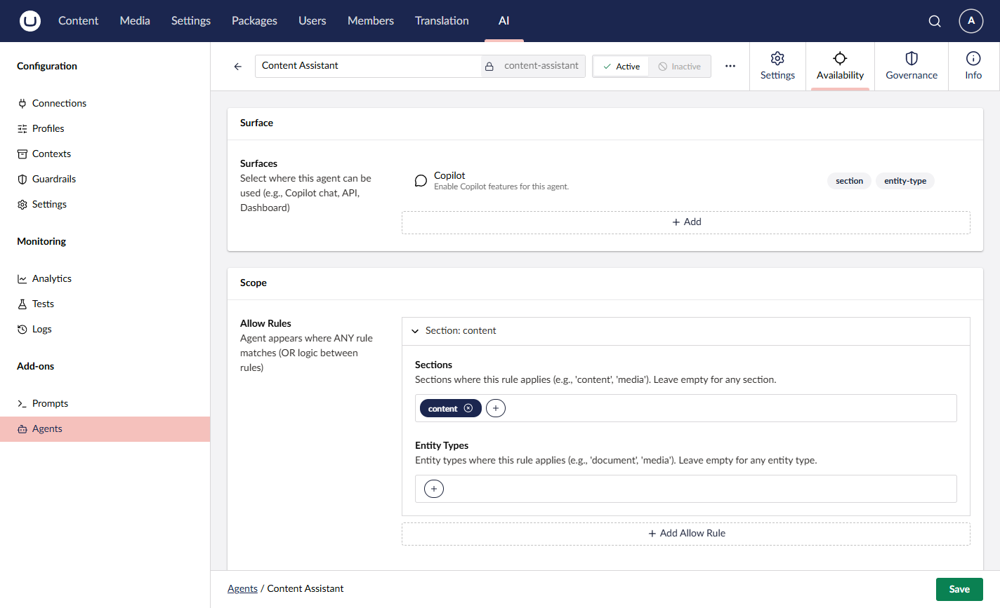

# Agent Scopes

Scopes allow you to categorize agents for specific purposes. Add-on packages can register their own scopes, and agents can be assigned to one or more scopes to indicate their intended use.

## What are Scopes?

Scopes are categorization tags that:

- **Group agents** by their intended context (e.g., "copilot", "content-editing")
- **Enable filtering** via the API to find agents for specific purposes
- **Allow extensibility** - any add-on package can define new scopes
- **Support multiple assignments** - agents can belong to several scopes


An agent with no scopes will appear in general listings but will not be returned when filtering by a specific scope.


## Built-in Scopes

The **Agent Copilot** add-on registers the `copilot` scope, which indicates agents that should appear in the copilot chat sidebar.

| Scope ID  | Package                  | Icon        | Description                                  |
| --------- | ------------------------ | ----------- | -------------------------------------------- |
| `copilot` | Umbraco.AI.Agent.Copilot | `icon-chat` | Agents available in the copilot chat sidebar |

## Assigning Scopes to Agents

### Via Backoffice

When creating or editing an agent in the backoffice, you can assign scopes in the **Scopes** section. Available scopes are populated from all registered scope providers.



### Via API

Include `scopeIds` when creating or updating an agent:



```json
{
    "alias": "content-assistant",
    "name": "Content Assistant",
    "scopeIds": ["copilot"],
    "instructions": "You are a helpful content assistant."
}
```



### Via Code



```csharp
var agent = new AIAgent
{
    Alias = "content-assistant",
    Name = "Content Assistant",
    ScopeIds = ["copilot", "content-editing"],
    Instructions = "You are a helpful content assistant."
};

await _agentService.SaveAgentAsync(agent);
```



## Querying Agents by Scope

### List Agents by Scope

Use the `scopeId` query parameter to filter agents:



```http
GET /umbraco/ai/management/api/v1/agent?scopeId=copilot
```



### Get All Registered Scopes

Retrieve all scopes registered in the system:



```http
GET /umbraco/ai/management/api/v1/agent/scopes
```





```json
[
    {
        "id": "copilot",
        "icon": "icon-chat"
    }
]
```



### Via Service



```csharp
// Get agents by scope
var copilotAgents = await _agentService.GetAgentsByScopeAsync("copilot");

// Or use paged query with scope filter
var pagedResult = await _agentService.GetAgentsPagedAsync(
    skip: 0,
    take: 10,
    scopeId: "copilot"
);
```



## Creating Custom Scopes

Add-on packages can register their own scopes to categorize agents for their specific features.

### 1. Define the Scope Class

Create a class that derives from `AIAgentScopeBase` and decorate it with the `[AIAgentScope]` attribute:



```csharp
using Umbraco.AI.Agent.Core.Scopes;

namespace MyPackage.Scopes;

[AIAgentScope("my-feature", Icon = "icon-settings")]
public class MyFeatureScope : AIAgentScopeBase
{
    /// <summary>
    /// Constant for referencing this scope ID in code.
    /// </summary>
    public const string ScopeId = "my-feature";
}
```



### 2. Automatic Registration

Scopes are automatically discovered and registered during application startup. The framework scans for all types with the `[AIAgentScope]` attribute that implement `IAIAgentScope`.

### 3. Manual Registration (Optional)

For more control, you can manually register scopes in a composer:



```csharp
using Umbraco.Cms.Core.Composing;
using Umbraco.AI.Agent.Core.Configuration;

namespace MyPackage;

public class MyComposer : IComposer
{
    public void Compose(IUmbracoBuilder builder)
    {
        builder.AIAgentScopes()
            .Add<MyFeatureScope>();
    }
}
```



### 4. Query Agents by Your Scope



```csharp
public class MyFeatureService
{
    private readonly IAIAgentService _agentService;

    public MyFeatureService(IAIAgentService agentService)
    {
        _agentService = agentService;
    }

    public async Task<IEnumerable<AIAgent>> GetMyFeatureAgentsAsync(
        CancellationToken cancellationToken = default)
    {
        return await _agentService.GetAgentsByScopeAsync(
            MyFeatureScope.ScopeId,
            cancellationToken);
    }
}
```



## Frontend Localization

Scope names and descriptions are localized on the frontend using a naming convention:

| Key Pattern                          | Purpose                    |
| ------------------------------------ | -------------------------- |
| `uaiAgentScope_{scopeId}Label`       | Display name for the scope |
| `uaiAgentScope_{scopeId}Description` | Description shown in UI    |

**Example for a custom "content-editing" scope:**



```typescript
export default {
    uaiAgentScope_contentEditingLabel: "Content Editing",
    uaiAgentScope_contentEditingDescription: "Agents for inline content editing",
};
```



## Best Practices

- **Use lowercase, hyphenated IDs** - Use URL-safe identifiers like `content-editing` and define a `ScopeId` constant for code references.
- **Keep scopes single-purpose** - Each scope should represent one clear use case, with localization keys for UI display.

## Related

- [Agent Concepts](concepts.md) - Agent overview
- [API: List Agents](api/list.md) - List endpoint with scope filtering
- [Agent Copilot](../agent-copilot/README.md) - Copilot scope usage
