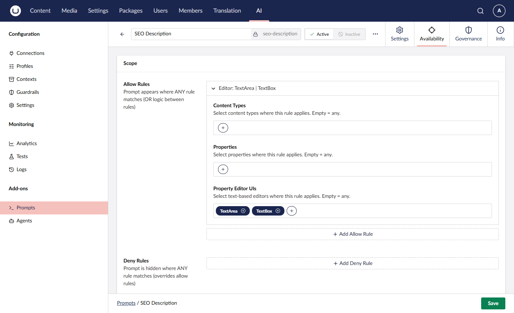

# Prompt Scoping

Scoping allows you to control which content types can use a prompt. This helps organize prompts for specific editorial workflows.

## Scope Modes

| Mode      | Description                                     |
| --------- | ----------------------------------------------- |
| **None**  | Any content type can use the prompt (default)   |
| **Allow** | Only specified content types can use the prompt |
| **Deny**  | All content types except those specified        |

## Configuring Scope

### Via Backoffice

1. Edit the prompt
2. Expand the **Scope** section
3. Select the scope mode
4. For Allow/Deny modes, select content types
5. Save



### Via Code



```csharp
var prompt = new AIPrompt
{
    Alias = "product-description",
    Name = "Product Description",
    Instructions = "Write a product description...",
    Scope = new AIPromptScope
    {
        Mode = AIPromptScopeMode.Allow,
        ContentTypeAliases = new[] { "product", "productVariant" }
    }
};

await _promptService.SavePromptAsync(prompt);
```



### Via API



```json
{
    "alias": "product-description",
    "name": "Product Description",
    "instructions": "Write a product description...",
    "scope": {
        "mode": "Allow",
        "contentTypeAliases": ["product", "productVariant"]
    }
}
```



## Scope Model



```csharp
public class AIPromptScope
{
    public AIPromptScopeMode Mode { get; set; } = AIPromptScopeMode.None;
    public IReadOnlyList<string> ContentTypeAliases { get; set; } = Array.Empty<string>();
}

public enum AIPromptScopeMode
{
    None = 0,   // No restriction
    Allow = 1,  // Only specified types
    Deny = 2    // All except specified types
}
```



## Use Cases

### Editorial Specialization

Create prompts specific to content types:

| Prompt              | Scope Mode | Content Types         |
| ------------------- | ---------- | --------------------- |
| Product Description | Allow      | `product`             |
| Blog Summary        | Allow      | `blogPost`, `article` |
| Press Release       | Allow      | `pressRelease`        |
| Generic Rewrite     | None       | (all types)           |

### Excluding Types

Prevent certain prompts from being used on sensitive content:

| Prompt        | Scope Mode | Content Types                   |
| ------------- | ---------- | ------------------------------- |
| Auto-Generate | Deny       | `legalNotice`, `termsOfService` |

## Enforcement


Scoping is enforced in the backoffice UI but **not** when executing prompts via code or API. It's designed for editorial guidance, not security.


### Backoffice Behavior

- Prompts outside scope won't appear in content editors
- Editors see only relevant prompts for each content type
- Improves UX by reducing prompt lists

### Code/API Behavior

- Scoping is not enforced programmatically
- You can execute any prompt on any content
- Implement your own checks if needed:



```csharp
public async Task<string?> ExecuteWithScopeCheckAsync(
    Guid promptId,
    string contentTypeAlias,
    AIPromptExecutionRequest request)
{
    var prompt = await _promptService.GetPromptAsync(promptId);
    if (prompt == null) return null;

    // Check scope
    if (!prompt.Scope.IsAllowed(contentTypeAlias))
    {
        throw new InvalidOperationException(
            $"Prompt '{prompt.Alias}' is not allowed for content type '{contentTypeAlias}'");
    }

    var result = await _promptService.ExecutePromptAsync(promptId, request);
    return result.Response;
}
```



## Related

- [Concepts](concepts.md) - Prompt fundamentals
- [Template Syntax](template-syntax.md) - Variable interpolation
