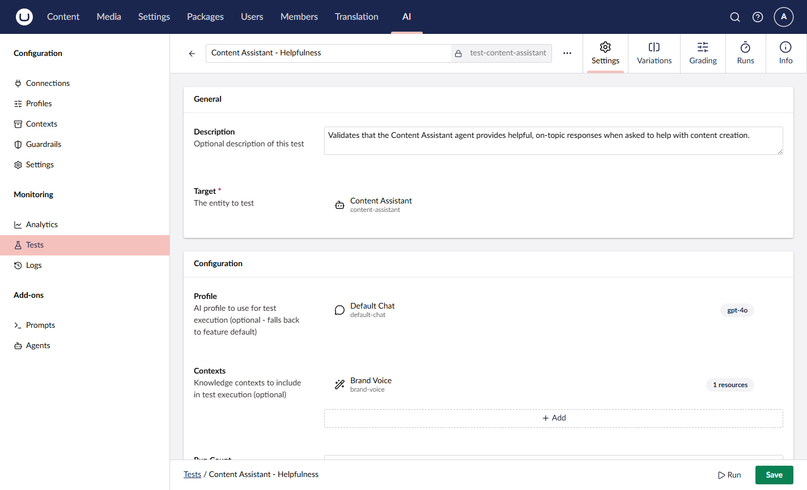
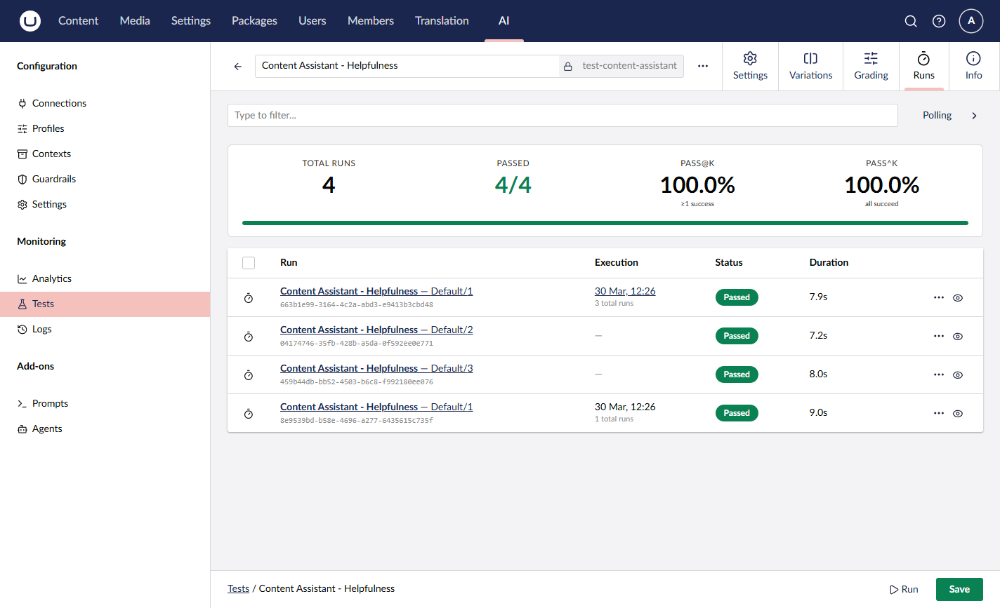

# Getting Started with Testing

This guide walks you through creating and running your first AI test.

## Prerequisites

Before starting, ensure you have:

- Umbraco.AI installed and configured
- At least one AI connection set up
- At least one chat profile created
- A prompt or agent to test (via the Prompt Management or Agent Runtime add-on)

## Step 1: Create a Test via the API

Create a test that validates a summarization prompt produces output containing bullet points.



```bash
curl -X POST "https://your-site.com/umbraco/ai/management/api/v1/tests" \
  -H "Authorization: Bearer YOUR_ACCESS_TOKEN" \
  -H "Content-Type: application/json" \
  -d '{
    "alias": "test-summarize-format",
    "name": "Summarization Format Check",
    "description": "Validates that the summarization prompt returns bullet points",
    "testFeatureId": "prompt",
    "testTargetId": "YOUR_PROMPT_GUID",
    "runCount": 1,
    "graders": [
      {
        "graderTypeId": "contains",
        "name": "Has bullet points",
        "config": {
          "searchPattern": "- ",
          "ignoreCase": true
        },
        "severity": "Error",
        "weight": 1.0
      }
    ],
    "tags": ["format"]
  }'
```



The response returns the created test with its generated `id`.



## Step 2: Run the Test

Execute the test to produce a run with grader results.



```bash
curl -X POST "https://your-site.com/umbraco/ai/management/api/v1/tests/test-summarize-format/run" \
  -H "Authorization: Bearer YOUR_ACCESS_TOKEN" \
  -H "Content-Type: application/json" \
  -d '{}'
```



The response includes execution metrics:



```json
{
    "testId": "3fa85f64-5717-4562-b3fc-2c963f66afa6",
    "executionId": "a1b2c3d4-e5f6-7890-abcd-ef1234567890",
    "defaultMetrics": {
        "testId": "3fa85f64-5717-4562-b3fc-2c963f66afa6",
        "totalRuns": 1,
        "passedRuns": 1,
        "passAtK": 1.0,
        "passToTheK": 1.0,
        "runIds": ["b2c3d4e5-f6a7-8901-bcde-f12345678901"]
    },
    "variationMetrics": [],
    "aggregateMetrics": {
        "testId": "3fa85f64-5717-4562-b3fc-2c963f66afa6",
        "totalRuns": 1,
        "passedRuns": 1,
        "passAtK": 1.0,
        "passToTheK": 1.0,
        "runIds": ["b2c3d4e5-f6a7-8901-bcde-f12345678901"]
    }
}
```



## Step 3: Review Run Details

Use the run ID from the metrics to retrieve detailed results.



```bash
curl -X GET "https://your-site.com/umbraco/ai/management/api/v1/test-runs?testId=3fa85f64-5717-4562-b3fc-2c963f66afa6" \
  -H "Authorization: Bearer YOUR_ACCESS_TOKEN"
```



Each run includes the status, duration, outcome, and per-grader results.



## Step 4: Add an LLM Judge Grader

Update the test to add a model-based grader that evaluates output quality.



```bash
curl -X PUT "https://your-site.com/umbraco/ai/management/api/v1/tests/YOUR_TEST_GUID" \
  -H "Authorization: Bearer YOUR_ACCESS_TOKEN" \
  -H "Content-Type: application/json" \
  -d '{
    "alias": "test-summarize-format",
    "name": "Summarization Format Check",
    "testFeatureId": "prompt",
    "testTargetId": "YOUR_PROMPT_GUID",
    "runCount": 3,
    "graders": [
      {
        "graderTypeId": "contains",
        "name": "Has bullet points",
        "config": { "searchPattern": "- ", "ignoreCase": true },
        "severity": "Error",
        "weight": 1.0
      },
      {
        "graderTypeId": "llm-judge",
        "name": "Summary quality",
        "config": {
          "evaluationCriteria": "Is the summary concise, accurate, and well-structured?",
          "passThreshold": 0.7
        },
        "severity": "Error",
        "weight": 1.0
      }
    ],
    "tags": ["format", "quality"]
  }'
```



The `runCount` is set to 3 so the framework calculates pass@k metrics across multiple runs.

## Step 5: Set a Baseline

After a passing run, set the baseline for future regression detection.



```bash
curl -X POST "https://your-site.com/umbraco/ai/management/api/v1/test-runs/SET_RUN_ID_HERE/set-baseline" \
  -H "Authorization: Bearer YOUR_ACCESS_TOKEN"
```



## Next Steps

- Add [Variations](variations.md) to compare different models
- Explore all built-in [Graders](graders.md)
- Use [Batch Execution](api/run-batch.md) to run multiple tests at once
- Use [Tag-based Execution](api/run-by-tags.md) to run tests by category
- Review the full [API Reference](api/README.md)
