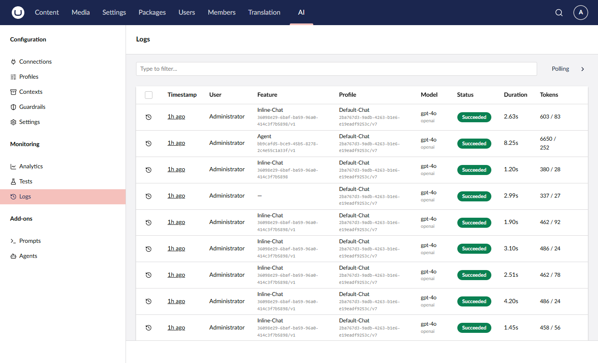
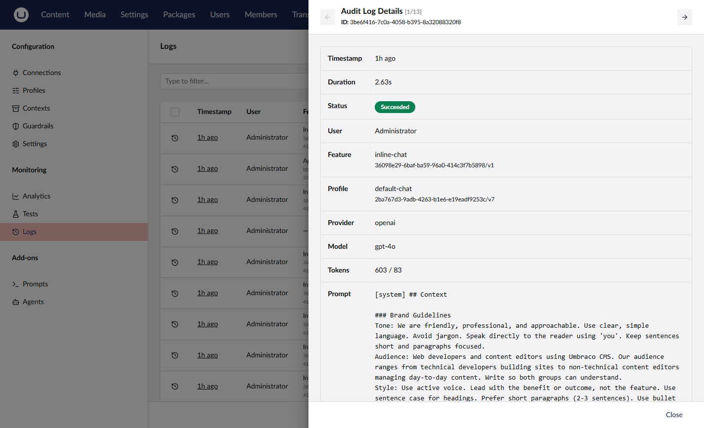

# Audit Logs

Every AI operation (chat completion, embedding generation) is logged with detailed information about the request, response, timing, and outcome. Use audit logs for monitoring, debugging, and compliance.

## Accessing Audit Logs

1. Navigate to the **AI** section in the main navigation
2. Click **Audit Logs** in the tree

## Understanding the Log List



The log list shows recent AI operations:

| Column     | Description                           |
| ---------- | ------------------------------------- |
| Time       | When the operation started            |
| Status     | Outcome (Succeeded, Failed, etc.)     |
| Capability | Type of operation (Chat, Embedding)   |
| Profile    | Which profile was used                |
| Provider   | AI provider (OpenAI, Anthropic, etc.) |
| Model      | Specific model used                   |
| User       | Who initiated the operation           |
| Tokens     | Total tokens used                     |
| Duration   | How long the operation took           |

## Filtering Logs

Use the filter options to narrow results:

| Filter     | Description              |
| ---------- | ------------------------ |
| Date Range | From and To dates        |
| Status     | Success, Failed, Blocked, Running |
| Capability | Chat, Embedding          |
| Profile    | Specific profile         |
| Provider   | Specific provider        |
| User       | Specific user            |

### Example Filters

- **Failed operations today**: Status = Failed, Date = Today
- **High token usage**: Sort by Tokens descending
- **Specific user activity**: User = john@example.com

## Viewing Log Details

Click a log entry to view full details:



### Summary

- Start time, end time, duration
- Status and any error information
- User who initiated the operation

### AI Configuration

- Profile used (with version)
- Provider and model
- Feature type (prompt, agent, or direct)

### Token Usage

- Input tokens (request)
- Output tokens (response)
- Total tokens

### Content (if captured)

Depending on the configuration:

- **Prompt snapshot** - The actual request sent (if `PersistPrompts` is enabled)
- **Response snapshot** - The AI's response (if `PersistResponses` is enabled)


Content snapshots are controlled by the `PersistPrompts` and `PersistResponses` configuration options. Both default to true.


## Status Values

| Status             | Description                       |
| ------------------ | --------------------------------- |
| **Succeeded**      | Operation completed successfully  |
| **Failed**         | Operation encountered an error    |
| **Running**        | Operation is in progress          |
| **Blocked**        | Blocked by a guardrail rule       |
| **Cancelled**      | Operation was cancelled           |
| **PartialSuccess** | Some parts succeeded, some failed |

## Error Categories

When operations fail, the error category helps diagnose the issue:

| Category          | Description                  |
| ----------------- | ---------------------------- |
| Authentication    | Authentication failure       |
| RateLimiting      | Provider rate limit exceeded |
| ModelNotFound     | Requested model not available|
| InvalidRequest    | Invalid request parameters   |
| ServerError       | Provider server error        |
| NetworkError      | Network connectivity issue   |
| ContextResolution | Context resolution failure   |
| ToolExecution     | Tool execution failure       |
| GuardrailBlocked  | Blocked by guardrail rule    |
| Unknown           | Unclassified error           |

## Deleting Logs

To delete a specific log:

1. Select the log entry
2. Click **Delete**
3. Confirm the deletion


Deleting audit logs is permanent. Consider your compliance requirements before deletion.


## Cleanup

To remove old logs:

1. Click **Cleanup** in the toolbar
2. Specify how old logs should be (e.g., 90 days)
3. Confirm the cleanup

### Automatic Cleanup

Configure audit log options in `appsettings.json`:



```json
{
    "Umbraco": {
        "AI": {
            "AuditLog": {
                "Enabled": true,
                "RetentionDays": 14,
                "PersistPrompts": true,
                "PersistResponses": true,
                "PersistFailureDetails": true,
                "RedactionPatterns": []
            }
        }
    }
}
```



| Property               | Default | Description                                      |
| ---------------------- | ------- | ------------------------------------------------ |
| `Enabled`              | `true`  | Whether audit logging is enabled                 |
| `RetentionDays`        | `14`    | Number of days to retain logs before cleanup      |
| `PersistPrompts`       | `true`  | Store prompt snapshots in logs                   |
| `PersistResponses`     | `true`  | Store response snapshots in logs                 |
| `PersistFailureDetails`| `true`  | Store failure details in logs                    |
| `RedactionPatterns`    | `[]`    | Regex patterns for redacting sensitive content   |

## Related

- [Usage Analytics](usage-analytics.md) - Aggregated statistics
- [Audit Logs API](../management-api/audit-logs/README.md) - Programmatic access
