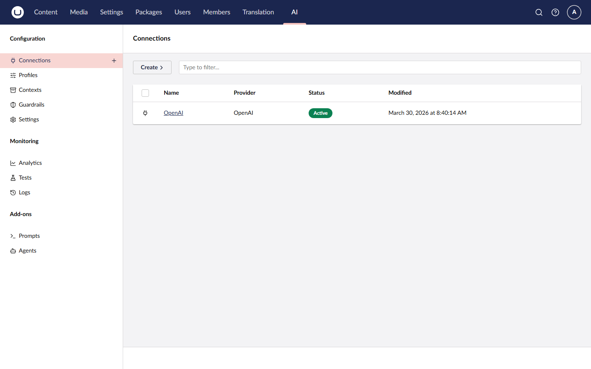

# Managing Connections

Connections store the credentials needed to communicate with AI providers. Manage them through the backoffice UI.

## Viewing Connections

1. Navigate to the **AI** section > **Connections**
2. The connection list shows all configured connections
3. Click a connection to view or edit its details



## Creating a Connection

1. Click **Create Connection** in the Connections section
2. Fill in the required fields:

| Field        | Description                      |
| ------------ | -------------------------------- |
| **Name**     | Display name for the connection  |
| **Alias**    | Unique identifier (used in code) |
| **Provider** | Select from installed providers  |

3. Configure provider-specific settings (varies by provider)
4. Click **Save**


### OpenAI Provider Settings

When using the OpenAI provider:

| Setting          | Description                     | Required |
| ---------------- | ------------------------------- | -------- |
| **API Key**      | Your OpenAI API key             | Yes      |
| **Organization** | Organization ID (if applicable) | No       |

## Using Configuration References

Instead of storing API keys directly in the database, use configuration references:

1. Add your API key to `appsettings.json`:



```json
{
    "OpenAI": {
        "ApiKey": "sk-your-api-key-here"
    }
}
```



2. In the connection settings, enter `$OpenAI:ApiKey` as the API Key value

The `$` prefix tells Umbraco.AI to resolve the value from configuration at runtime.


Configuration references keep sensitive values out of the database and allow different values per environment.


## Editing a Connection

1. Click on the connection in the list
2. Modify the desired fields
3. Click **Save**


Changing a connection's provider is not supported. Create a new connection instead.


## Deleting a Connection

1. Open the connection you want to delete
2. Click **Delete** in the actions menu
3. Confirm the deletion


Deleting a connection will break any profiles that depend on it. Consider deactivating the connection instead.


## Enabling and Disabling Connections

Use the **Active** toggle to enable or disable a connection:

- **Active** - Connection is available for use
- **Inactive** - Connection is disabled; profiles using it will fail

This is useful for:

- Temporarily disabling a connection without deleting it
- Rotating API keys (create new connection, disable old one)
- Testing failover scenarios

## Best Practices

1. **Use descriptive names** - "OpenAI Production" is better than "Connection 1"
2. **Use configuration references** - Keep API keys out of the database
3. **Create separate connections per environment** - Don't share production keys in development
4. **Use meaningful aliases** - They're used in code and should be readable

## Related

- [Managing Profiles](managing-profiles.md) - Create profiles using connections
- [Connections Concept](../concepts/connections.md) - Deeper explanation of connections
