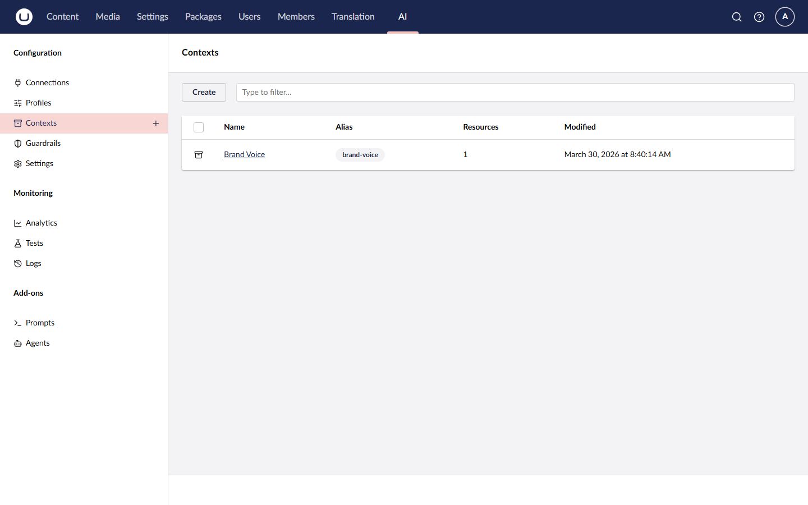
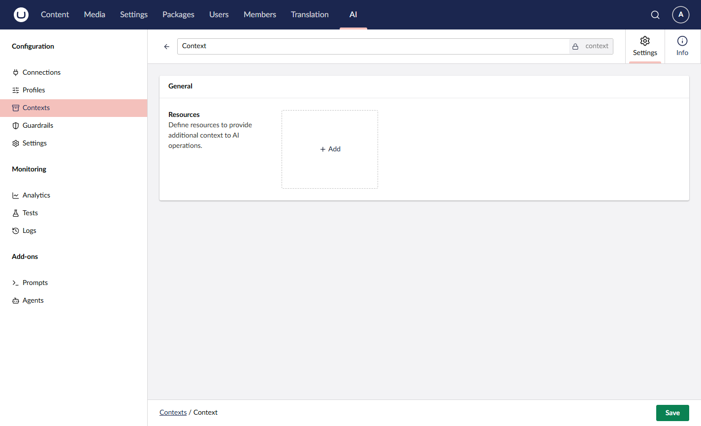
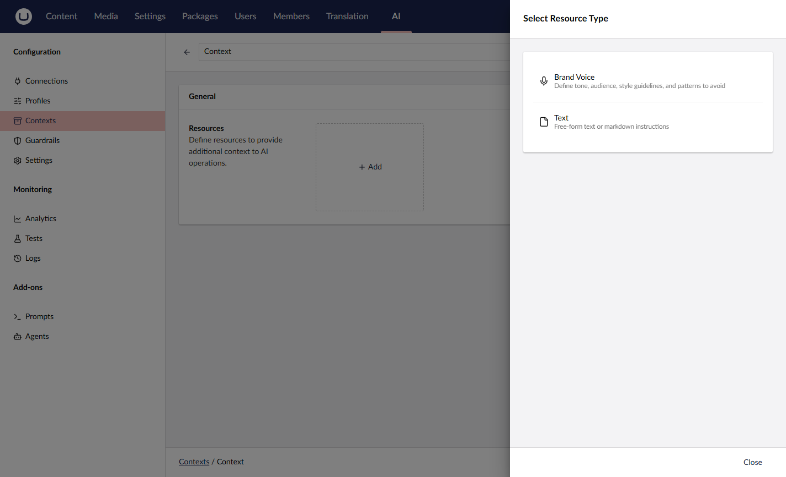
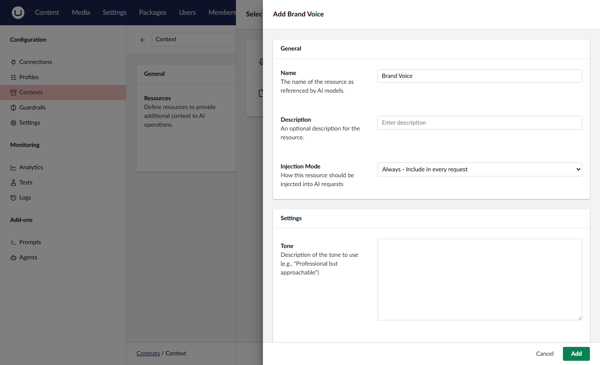
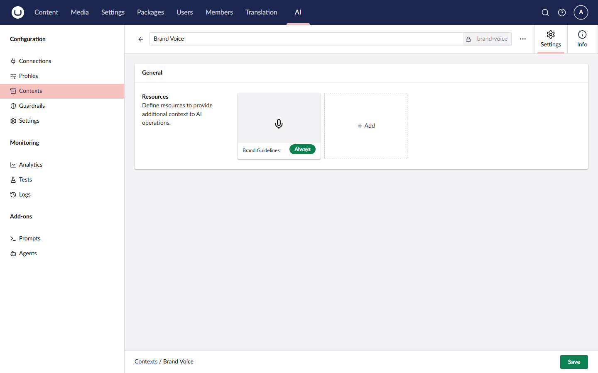

# Managing Contexts

AI Contexts allow you to define reusable content collections like brand voice guidelines, terminology, and reference materials that get injected into AI operations.

## Accessing Contexts

1. Navigate to the **AI** section in the main navigation
2. Click **Contexts** in the tree



## Creating a Context

1. Click **Create Context** in the toolbar
2. Fill in the required fields:

| Field | Description                                                 |
| ----- | ----------------------------------------------------------- |
| Alias | Unique identifier for code references (URL-safe, no spaces) |
| Name  | Display name shown in the backoffice                        |

3. Click **Create**



## Adding Resources

Contexts contain one or more resources. Each resource represents a piece of content to inject:

1. In the context editor, click **Add Resource**
2. Configure the resource:

| Field          | Description                         |
| -------------- | ----------------------------------- |
| Type           | The type of resource (e.g., Text)   |
| Name           | Display name for organization       |
| Description    | Optional description                |
| Content        | The actual content to inject        |
| Injection Mode | When to inject: Always or On Demand |

3. Click **Add**





### Resource Types

| Type         | Use Case                                          |
| ------------ | ------------------------------------------------- |
| **Text**     | Plain text content like guidelines or terminology |
| **Document** | Structured content with metadata                  |



## Editing a Context

1. Select the context from the list
2. Modify fields as needed
3. Add, edit, or remove resources
4. Click **Save**


Every save creates a new version. You can view and rollback to previous versions.


## Deleting a Context

1. Select the context from the list
2. Click **Delete** in the toolbar
3. Confirm the deletion


Deleting a context also removes all version history. Consider whether any prompts or agents reference this context before deletion.


## Example: Brand Voice Context

A typical brand voice context might include:

**Name**: Brand Voice Guidelines

**Resources**:

1. **Tone of Voice** (Always)

    ```
    Our brand voice is:
    - Friendly and approachable
    - Professional but not stuffy
    - Clear and jargon-free
    - Empowering and positive
    ```

2. **Writing Style** (Always)

    ```
    Writing guidelines:
    - Use active voice
    - Keep sentences short
    - Address the reader as "you"
    - Avoid technical jargon
    ```

3. **Terminology** (Always)
    ```
    Preferred terms:
    - Use "customers" not "users"
    - Use "help" not "assist"
    - Use "simple" not "easy"
    ```

## Using Contexts

Contexts are used by:

- **Prompts** - Associate contexts to inject guidelines
- **Agents** - Include context in agent instructions
- **Profiles** - System prompts can reference context content

### Associating with a Prompt

When editing a prompt:

1. Expand the **Contexts** section
2. Click **Add Context**
3. Select the context(s) to include
4. Save the prompt

## Version History

See [Version History](version-history.md) for information on viewing and restoring previous versions.

## Related

- [Contexts Concept](../concepts/contexts.md) - Understanding contexts
- [Version History](version-history.md) - Tracking changes
