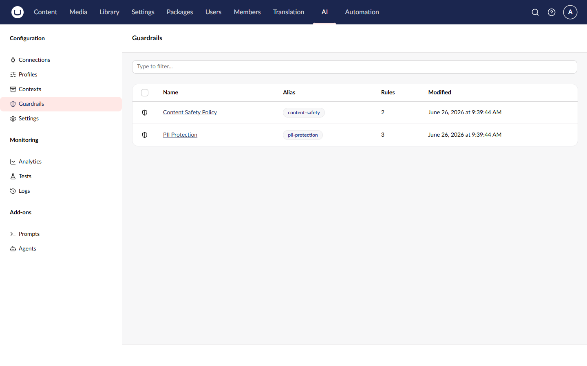
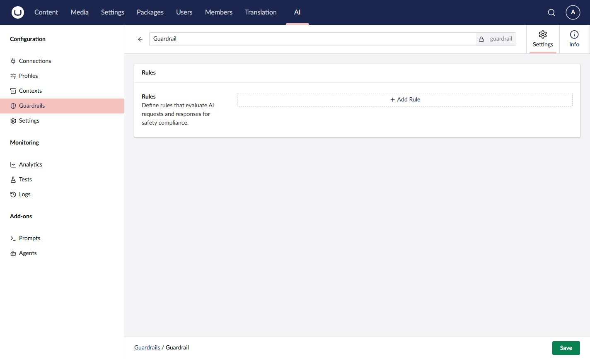
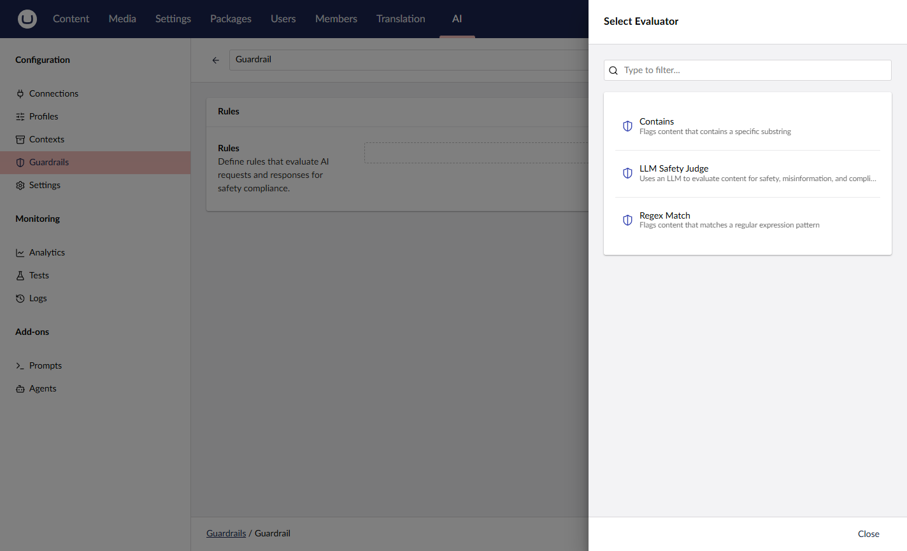
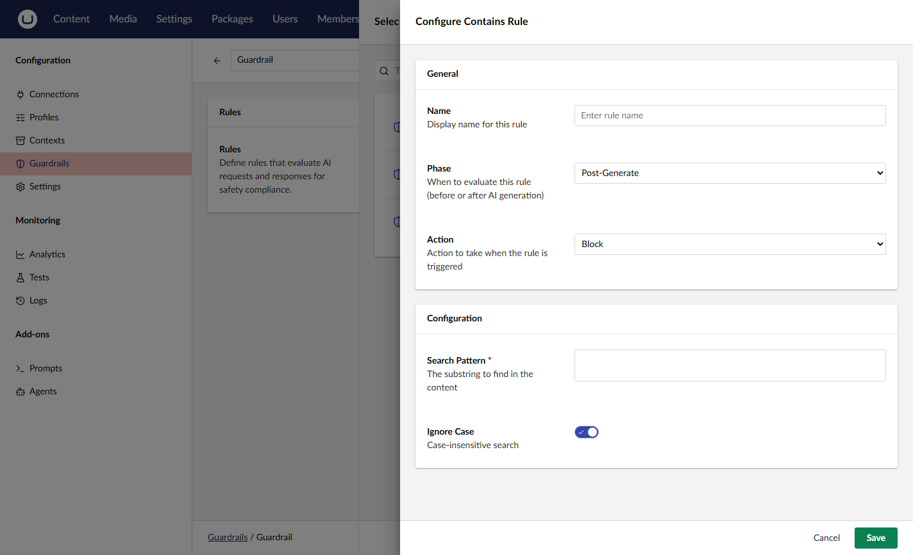

# Managing Guardrails

AI Guardrails allow you to define safety, compliance, and quality rules that evaluate AI inputs and responses at runtime. Rules can block, warn, or redact when content is flagged.

## Accessing Guardrails

1. Navigate to the **AI** section in the main navigation
2. Click **Guardrails** in the tree

## Creating a Guardrail

1. Click **Create Guardrail** in the toolbar
2. Fill in the required fields:

| Field | Description                                                 |
| ----- | ----------------------------------------------------------- |
| Alias | Unique identifier for code references (URL-safe, no spaces) |
| Name  | Display name shown in the backoffice                        |

3. Click **Create**

## Adding Rules

Guardrails contain one or more rules. Each rule references a registered evaluator that performs the actual content evaluation:

1. In the guardrail editor, click **Add Rule**
2. Configure the rule:

| Field       | Description                                           |
| ----------- | ----------------------------------------------------- |
| Evaluator   | The evaluator to use (e.g., PII, Toxicity, LLM Judge) |
| Name        | Display name for the rule                             |
| Phase       | When to evaluate: Pre-Generate or Post-Generate       |
| Action      | What to do when flagged: Block, Warn, or Redact       |
| Config      | Evaluator-specific settings (optional)                |

3. Click **Add**

### Evaluation Phases

| Phase            | Description                                              |
| ---------------- | -------------------------------------------------------- |
| **Pre-Generate** | Evaluates user input before sending to the AI provider   |
| **Post-Generate**| Evaluates the AI response before returning to the user   |


Use Pre-Generate rules to prevent sensitive data (like PII) from being sent to AI providers. Use Post-Generate rules to validate AI responses meet your quality and safety standards.


### Actions

| Action     | Description                                                                      |
| ---------- | -------------------------------------------------------------------------------- |
| **Block**  | Stops processing and returns an error to the caller                              |
| **Warn**   | Allows the content through unchanged and logs a warning                          |
| **Redact** | Replaces flagged content with `[REDACTED]` before it reaches the AI model or caller |


The Redact option is only shown for evaluators that support it. Code-based evaluators (PII, Toxicity) support redaction. Model-based evaluators (LLM Judge) do not, because they cannot identify specific text positions.


### Available Evaluators

| Evaluator      | Type       | Description                                            |
| -------------- | ---------- | ------------------------------------------------------ |
| **PII**        | Code-based | Detects personal information (emails, phones, SSNs)    |
| **Toxicity**   | Code-based | Detects toxic or harmful language patterns             |
| **LLM Judge**  | Model-based| Uses an AI model to evaluate against custom criteria   |


Code-based evaluators run instantly using pattern matching. Model-based evaluators call an AI model for nuanced evaluation and may take longer.


### Reordering Rules

Rules are evaluated in order. To reorder:

1. Drag rules using the handle on the left
2. Or use the arrow buttons to move rules up/down

Rules at the top are evaluated first.

## Editing a Guardrail

1. Select the guardrail from the list
2. Modify fields as needed
3. Add, edit, or remove rules
4. Click **Save**


Every save creates a new version. You can view and rollback to previous versions.


## Deleting a Guardrail

1. Select the guardrail from the list
2. Click **Delete** in the toolbar
3. Confirm the deletion


Deleting a guardrail also removes all version history. Ensure the guardrail is not referenced by profiles, prompts, or agents before deletion.


## Example: Content Safety Guardrail

A typical content safety guardrail might include:

**Name**: Content Safety Policy

**Rules**:

1. **Block PII in inputs** (Pre-Generate, Block)
    - Evaluator: PII
    - Prevents personal information from being sent to AI providers

2. **Block PII in responses** (Post-Generate, Block)
    - Evaluator: PII
    - Prevents AI from generating personal information

3. **Block toxic content** (Post-Generate, Block)
    - Evaluator: Toxicity
    - Prevents harmful language in AI responses

4. **Quality check** (Post-Generate, Warn)
    - Evaluator: LLM Judge
    - Evaluates response quality against brand guidelines

## Example: PII Redaction Guardrail

A guardrail that strips sensitive data instead of blocking:

**Name**: PII Redaction Policy

**Rules**:

1. **Redact PII in inputs** (Pre-Generate, Redact)
    - Evaluator: PII
    - Replaces personal information with `[REDACTED]` before sending to the AI provider

2. **Redact PII in responses** (Post-Generate, Redact)
    - Evaluator: PII
    - Replaces any personal information in AI responses before returning to the user


Post-generate Redact rules do not work during streaming responses. When streaming, post-generate Redact rules degrade to Warn because chunks have already been sent to the caller and cannot be retroactively modified. Pre-generate Redact rules work normally in both streaming and non-streaming scenarios.


## Assigning Guardrails

Guardrails are assigned via the **Governance** tab on profiles, prompts, and agents:

- **Profiles** - Open a chat profile and go to the **Governance** tab to assign guardrails
- **Prompts** - Open a prompt and go to the **Governance** tab to assign guardrails (requires Prompt add-on)
- **Agents** - Open an agent and go to the **Governance** tab to assign guardrails (requires Agent add-on)

When multiple sources assign guardrails (e.g., both a profile and an agent), all guardrails are combined and deduplicated at runtime.

### Assigning to a Profile

When editing a chat profile:

1. Go to the **Governance** tab
2. Click **Add Guardrail** in the Guardrails section
3. Select the guardrail(s) to apply
4. Save the profile


Guardrails are only available for **Chat** profiles. Embedding profiles do not support guardrails.


### Assigning to a Prompt

When editing a prompt (requires Prompt add-on):

1. Go to the **Governance** tab
2. Click **Add Guardrail** in the Guardrails section
3. Select the guardrail(s) to apply
4. Save the prompt

### Assigning to an Agent

When editing an agent (requires Agent add-on):

1. Go to the **Governance** tab
2. Scroll to the **Guardrails** section (below Tool Permissions for standard agents)
3. Click **Add Guardrail**
4. Select the guardrail(s) to apply
5. Save the agent


The agent Governance tab also contains [Tool Permissions](../add-ons/agent/permissions.md) for standard agents.


## Version History

See [Version History](version-history.md) for information on viewing and restoring previous versions.

## Related

- [Guardrails Concept](../concepts/guardrails.md) - Understanding guardrails
- [Version History](version-history.md) - Tracking changes
