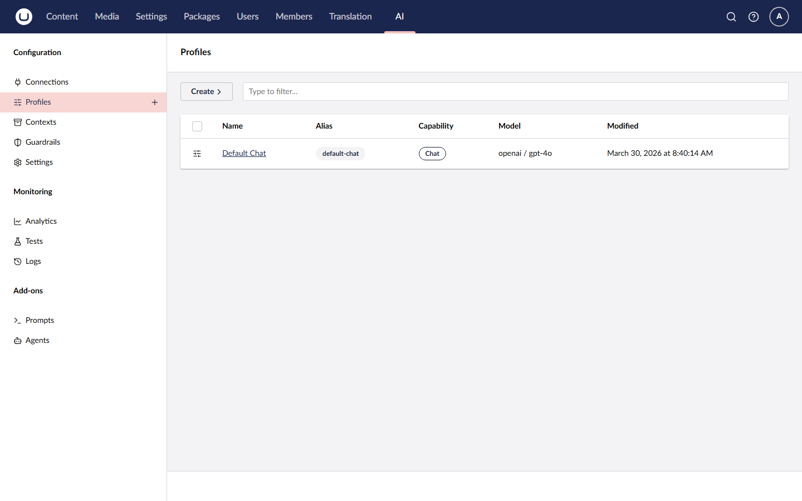
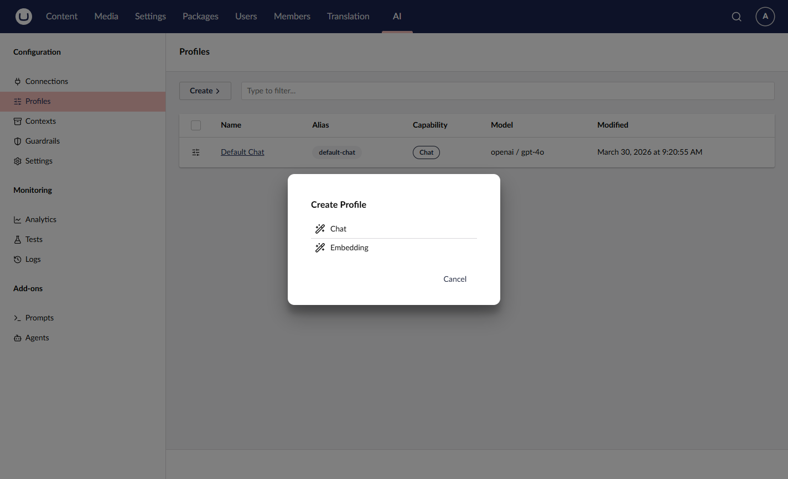
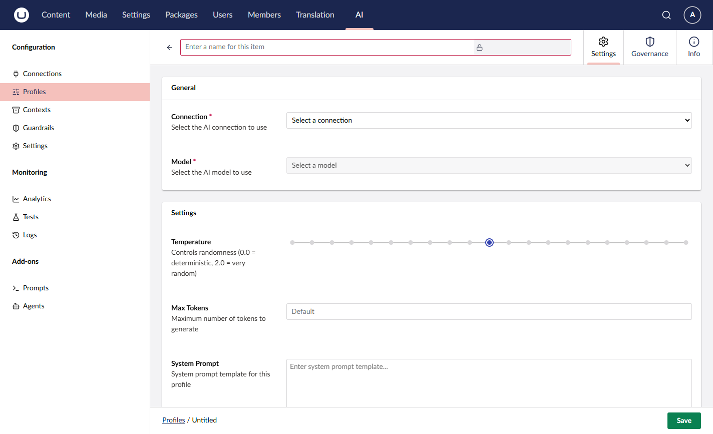
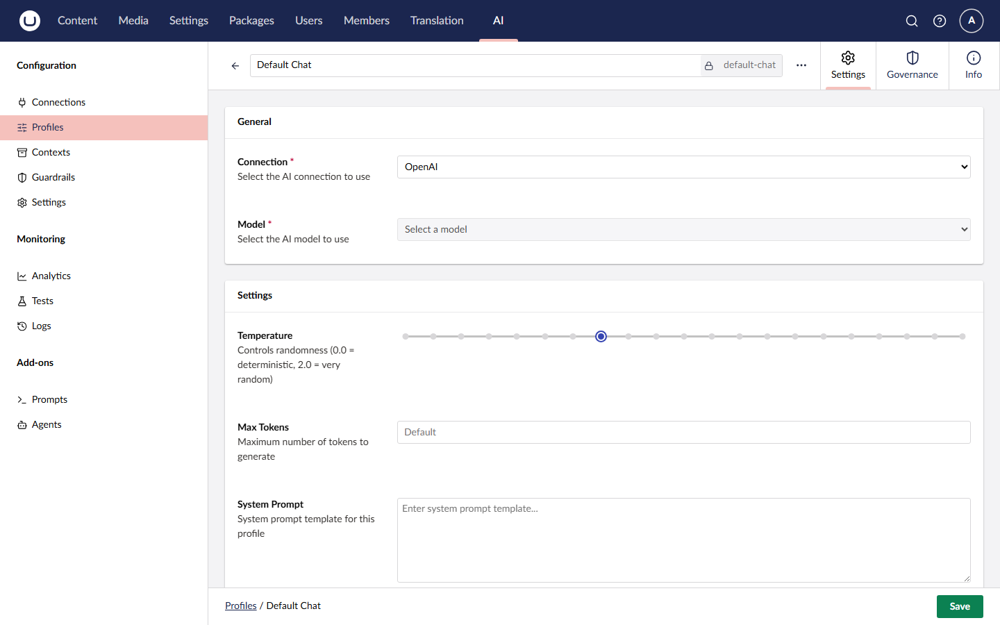
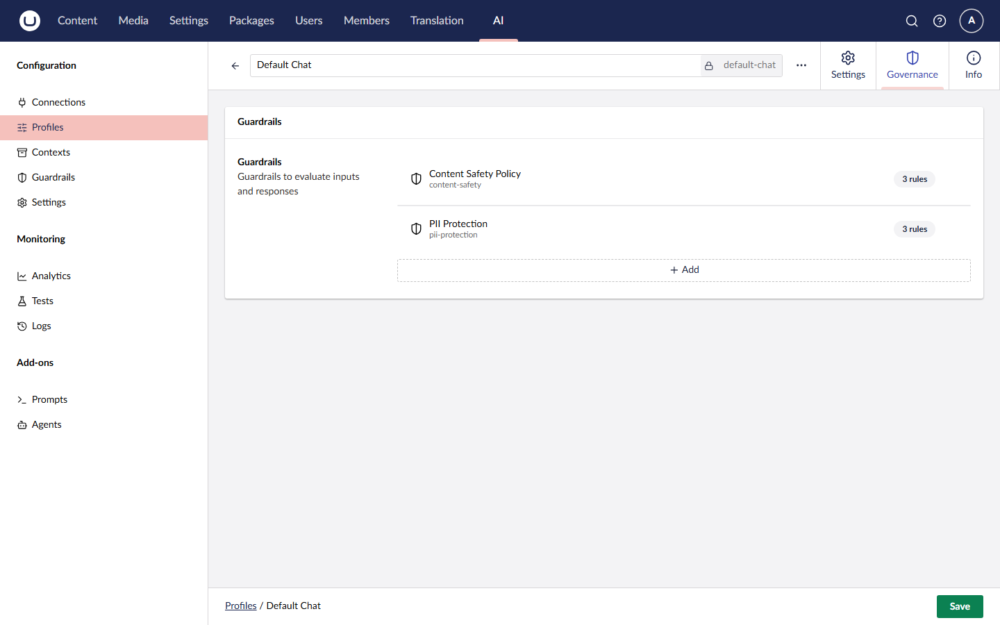

# Managing Profiles

Profiles combine a connection with model settings for specific use cases. Create different profiles for different AI tasks.

## Viewing Profiles

1. Navigate to the **AI** section > **Profiles**
2. The profile list shows all configured profiles
3. Use filters to find profiles by capability (Chat, Embedding)
4. Click a profile to view or edit its details



## Creating a Profile

1. Click **Create Profile** in the Profiles section
2. Fill in the required fields:

| Field          | Description                                     |
| -------------- | ----------------------------------------------- |
| **Name**       | Display name for the profile                    |
| **Alias**      | Unique identifier (used in code and as default) |
| **Capability** | Type of AI operation (Chat, Embedding)          |
| **Connection** | Which connection to use                         |
| **Model**      | The specific AI model                           |

3. Configure capability-specific settings
4. Click **Save**





## Chat Profile Settings



For profiles with the **Chat** capability:

| Setting           | Description                                                             | Default       |
| ----------------- | ----------------------------------------------------------------------- | ------------- |
| **Temperature**   | Controls randomness (0-2). Lower = more focused, higher = more creative | Model default |
| **Max Tokens**    | Maximum tokens in the response                                          | Model default |
| **System Prompt** | Instructions sent with every request                                    | None          |

### Temperature Guidelines

| Value     | Best For                                            |
| --------- | --------------------------------------------------- |
| 0.0 - 0.3 | Factual responses, code generation, data extraction |
| 0.4 - 0.7 | Balanced responses, general assistance              |
| 0.8 - 1.2 | Creative writing, brainstorming                     |

### System Prompts

System prompts set the AI's behavior for all requests using this profile:


```
You are a helpful content editor for a corporate website.
Write in a professional tone. Keep responses concise.
Always suggest improvements rather than making changes without explanation.
```



Leave settings empty to use the model's default values. Only configure what you need to override.


## Embedding Profile Settings

Embedding profiles currently use model defaults. Select the appropriate embedding model for your use case:

| Model                  | Dimensions | Best For                        |
| ---------------------- | ---------- | ------------------------------- |
| text-embedding-3-small | 1536       | Cost-effective, general purpose |
| text-embedding-3-large | 3072       | Higher accuracy, more storage   |

## Governance

Chat profiles have a **Governance** tab where you can assign [guardrails](managing-guardrails.md) to enforce safety, compliance, and quality rules on all AI operations using that profile.

1. Open a chat profile
2. Go to the **Governance** tab
3. Click **Add Guardrail** to select guardrails
4. Save the profile




The Governance tab is only available for **Chat** profiles. Embedding profiles do not support guardrails.


## Setting Default Profiles

To use a profile as the default when no profile is specified in code:

1. Navigate to the **AI** section > **Settings**
2. Select your chat profile via the **Default Chat Profile** picker
3. Select your embedding profile via the **Default Embedding Profile** picker
4. Click **Save**


See [Managing Settings](managing-settings.md) for more details on configuring default profiles.


## Editing a Profile

1. Click on the profile in the list
2. Modify the desired fields
3. Click **Save**


Changing a profile's capability is not supported after creation. Create a new profile instead.


## Deleting a Profile

1. Open the profile you want to delete
2. Click **Delete** in the actions menu
3. Confirm the deletion


Ensure no code depends on this profile before deleting. Check for usages of the profile alias in your codebase.


## Using Tags

Tags help organize profiles:

1. Add tags when creating or editing a profile
2. Use tags to categorize by team, project, or purpose
3. Tags are visible in the profile list

Example tags: `production`, `content-team`, `experimental`

## Related

- [Managing Connections](managing-connections.md) - Connections are required for profiles
- [Profiles Concept](../concepts/profiles.md) - Deeper explanation of profiles
- [Using Profiles in Code](../using-the-api/chat/basic-chat.md) - How to use profiles programmatically
