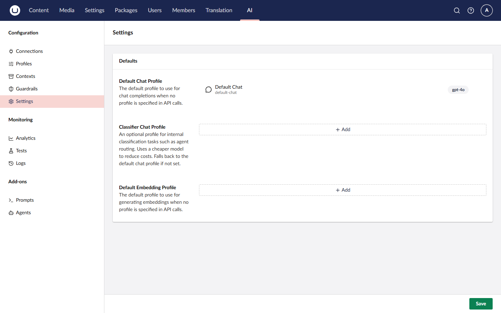

# Managing Settings

AI Settings provide a central place to configure system-wide defaults, including which profiles are used when no specific profile is specified.

## Accessing Settings

1. Navigate to the **AI** section in the main navigation
2. Click **Settings** in the tree

## Available Settings

### Default Chat Profile

The profile used for chat operations when no profile is explicitly specified.

| Field                | Description                         |
| -------------------- | ----------------------------------- |
| Default Chat Profile | Select from available chat profiles |

When set, this profile is used by:

- `IAIChatService.GetChatResponseAsync()` without a profile ID
- Prompts without an associated profile
- Agents without an associated profile

### Classifier Chat Profile

An optional profile for internal classification tasks such as agent routing. The classifier profile lets you use a cheaper or faster model for basic classification decisions, reducing costs.

| Field                      | Description                            |
| -------------------------- | -------------------------------------- |
| Classifier Chat Profile    | Select from available chat profiles    |

When set, this profile is used by:

- Agent routing in the Copilot's "Auto" mode (selecting the best agent for a user prompt)

If not set, the default chat profile is used instead.

### Default Embedding Profile

The profile used for embedding operations when no profile is explicitly specified.

| Field                     | Description                              |
| ------------------------- | ---------------------------------------- |
| Default Embedding Profile | Select from available embedding profiles |

When set, this profile is used by:

- `IAIEmbeddingService.GenerateEmbeddingsAsync()` without a profile ID

## Configuring Settings

1. Navigate to the **AI** section > **Settings**
2. Select the desired profiles via the pickers
3. Click **Save**

## Settings Precedence

Settings can be specified in multiple places. The order of precedence is:

1. **Explicit parameter** - Profile ID passed in code (always takes priority)
2. **Database settings** - Configured in the backoffice (this screen)


For advanced scenarios like CI/CD or infrastructure-as-code, defaults can also be configured in `appsettings.json`. However, database settings take precedence. See [Settings Concept](../concepts/settings.md) for details.


## When Defaults Are Used

| Scenario                                                 | Default Used  |
| -------------------------------------------------------- | ------------- |
| `_chatService.GetChatResponseAsync(chat => chat.WithAlias("my-feature"), messages)`            | Yes           |
| `_chatService.GetChatResponseAsync(chat => chat.WithAlias("my-feature").WithProfile(profileId), messages)` | No (explicit) |
| Prompt without ProfileId                                 | Yes           |
| Prompt with ProfileId                                    | No (explicit) |
| Agent without ProfileId                                  | Yes           |
| Agent with ProfileId                                     | No (explicit) |

## Clearing Defaults

To remove a default:

1. Open the picker
2. Select the empty option
3. Save

When no default is configured:

- Operations without an explicit profile will fail with an error

## Related

- [Settings Concept](../concepts/settings.md) - Understanding settings
- [Profiles](../concepts/profiles.md) - Profile configuration
