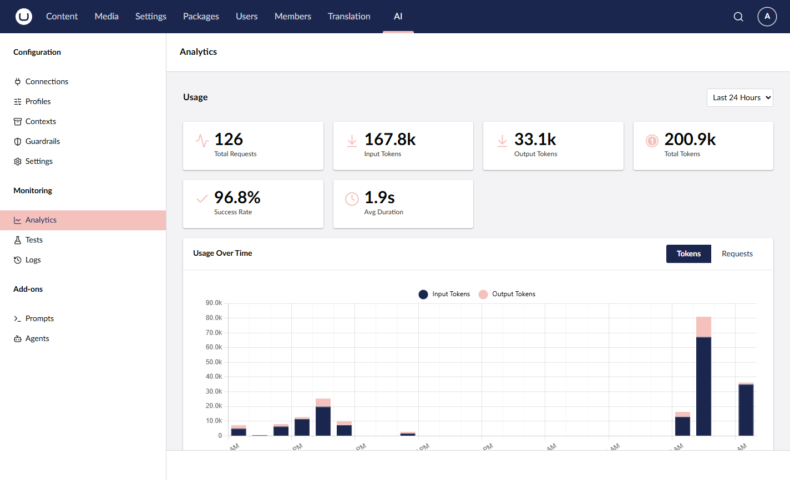
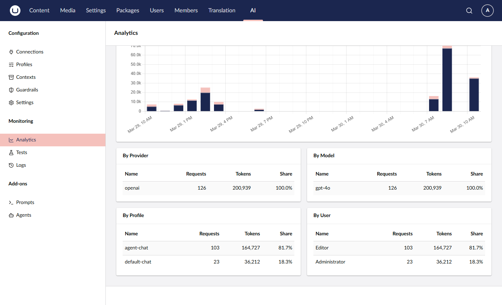

# Usage Analytics

The Usage Analytics dashboard provides aggregated insights into AI operations, helping you understand usage patterns and performance.

## Accessing Analytics

1. Navigate to the **AI** section in the main navigation
2. Click **Analytics** in the tree

## Dashboard Overview

### Summary Metrics

The dashboard displays six summary cards at the top:

| Metric           | Description                                    |
| ---------------- | ---------------------------------------------- |
| Total Requests   | Number of AI operations in the selected period |
| Input Tokens     | Tokens sent to AI providers                    |
| Output Tokens    | Tokens received from AI providers              |
| Total Tokens     | Combined input and output tokens               |
| Success Rate     | Percentage of successful operations            |
| Avg Duration     | Average operation response time                |

### Usage Over Time

A chart showing usage trends across the selected period. The chart displays:

- **Bars** for input tokens and output tokens per time bucket
- **Line** for total request count

### Breakdowns

Tables showing usage distribution across four dimensions:

- **By Provider** — Which providers handle the most requests and tokens
- **By Model** — Which models are used most
- **By Profile** — Which profiles are most active
- **By User** — Which users generate the most AI operations

Each breakdown table shows Name, Requests, Tokens, and Share (percentage).

## Date Range

Select the time period to analyze using the picker in the top-right corner:

| Range          | Description          |
| -------------- | -------------------- |
| Last 24 Hours  | Real-time monitoring |
| Last 7 Days    | Weekly trends        |
| Last 30 Days   | Monthly analysis     |

## Programmatic Access

For custom dashboards or integrations, use the [Analytics API](../management-api/analytics/README.md).

## Related

- [Audit Logs](audit-logs.md) - Individual AI operation records
- [Analytics API](../management-api/analytics/README.md) - Programmatic access
