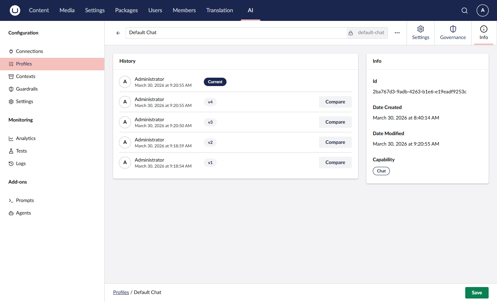
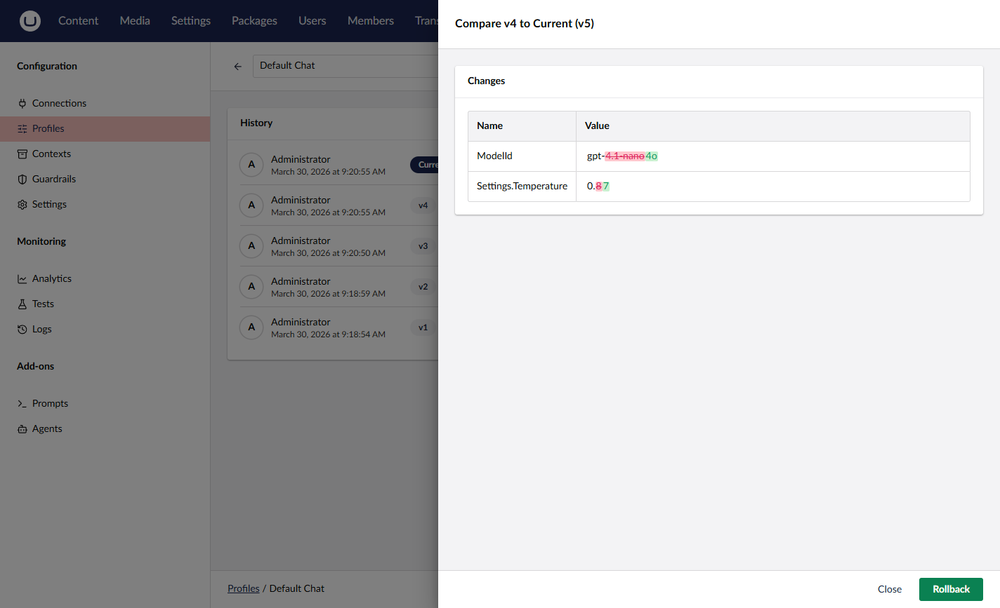

# Version History

Umbraco.AI automatically tracks version history for connections, profiles, contexts, prompts, and agents. You can view what changed, compare versions, and rollback to a previous state.

## Viewing Version History

1. Navigate to the entity (e.g., the **AI** section > **Profiles**)
2. Select the entity you want to view
3. Click the **Version History** tab (or icon)



The version history shows:

| Column      | Description                      |
| ----------- | -------------------------------- |
| Version     | Sequential version number        |
| Date        | When the version was created     |
| User        | Who made the change              |
| Description | Change description (if provided) |

## Comparing Versions

To see what changed between versions:

1. Open the version history
2. Select two versions to compare
3. Click **Compare**



The comparison view shows:

- **Added** - Properties or values that were added
- **Removed** - Properties or values that were removed
- **Modified** - Properties that changed, with before/after values

### Reading the Comparison


```diff
settings.temperature
- 0.5
+ 0.8

settings.systemPromptTemplate
- "You are an assistant."
+ "You are a helpful content assistant for a website."

tags[1]
+ "content"
```


## Rolling Back

To restore an entity to a previous version:

1. Open the version history
2. Find the version you want to restore
3. Click **Rollback** (or **Restore**)
4. Confirm the action


Rollback creates a new version with the restored content. No versions are deleted - the complete history is preserved.


### After Rollback

After rolling back to version 3:

| Version | Description             |
| ------- | ----------------------- |
| 6       | Restored from version 3 |
| 5       | Previous state          |
| 4       | ...                     |
| 3       | Target version          |

## Supported Entities

| Entity      | Package           | Location                    |
| ----------- | ----------------- | --------------------------- |
| Connections | Umbraco.AI        | AI > Connections |
| Profiles    | Umbraco.AI        | AI > Profiles    |
| Contexts    | Umbraco.AI        | AI > Contexts    |
| Prompts     | Umbraco.AI.Prompt | AI > Prompts     |
| Agents      | Umbraco.AI.Agent  | AI > Agents      |

## Version Cleanup

To prevent unbounded growth, old versions can be cleaned up:

### Automatic Cleanup

Configure in `appsettings.json`:



```json
{
    "Umbraco": {
        "AI": {
            "Versioning": {
                "MaxVersionsPerEntity": 50,
                "CleanupIntervalDays": 7
            }
        }
    }
}
```



### Manual Cleanup

Administrators can trigger cleanup via the Management API:


```http
POST /umbraco/ai/management/api/v1/versions/cleanup
```


## Best Practices

1. **Review before rollback** - Compare versions to understand what will change
2. **Use meaningful descriptions** - When updating via code, include change descriptions
3. **Configure cleanup** - Set appropriate retention for your needs
4. **Monitor storage** - Versions can accumulate significant data

## Programmatic Access

See [Versions API](../management-api/versions/README.md) for programmatic access to version history.

## Related

- [Version History Concept](../concepts/versioning.md) - Understanding versioning
- [Versions API](../management-api/versions/README.md) - Management API
