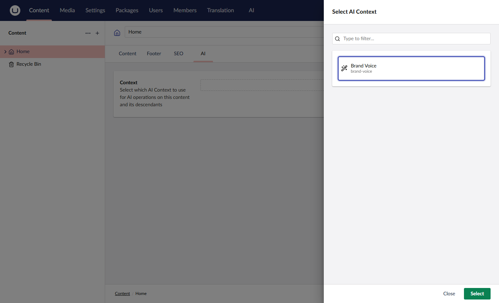

# Context Picker

The AI Context Picker (`Uai.ContextPicker`) is a property editor that allows content editors to assign AI Contexts to content nodes. When AI operations run, the system automatically resolves contexts by walking up the content tree.

## How It Works

```
┌─────────────────────────────────────────────────────────────┐
│                     Content Tree                            │
│                                                             │
│   Home (context: "corporate-brand")                         │
│   ├── About Us                                              │
│   │   └── Team ← AI operation here                          │
│   │       (inherits "corporate-brand" from Home)            │
│   │                                                         │
│   └── Products (context: "product-focused")                 │
│       └── Widget Pro ← AI operation here                    │
│           (uses "product-focused" from Products)            │
└─────────────────────────────────────────────────────────────┘
```

When an AI operation runs on content:

1. The resolver starts at the current content node
2. It walks up the tree to ancestors
3. It finds the first context picker property with a value
4. That context is used to enrich the AI operation

The tree-walking approach allows you to set a context once at a parent level and have all descendants inherit it automatically.

## Adding the Property Editor

### Create a Data Type

1. Navigate to **Settings** > **Data Types**
2. Click **Create Data Type**
3. Name it (e.g., "AI Context")
4. Select **AI Context Picker** as the property editor

### Configuration Options

| Option             | Description                           |
| ------------------ | ------------------------------------- |
| **Allow Multiple** | Enable selection of multiple contexts |
| **Minimum Items**  | Minimum contexts required (optional)  |
| **Maximum Items**  | Maximum contexts allowed (optional)   |

### Add to Document Type

1. Open your document type
2. Add a new property
3. Select your AI Context data type
4. Save




Place the context picker on parent content types (like Site or Section) to enable inheritance for all child content.


## Context Resolution

### Resolution Order

When an AI operation executes, contexts are resolved from multiple sources:

| Source  | Priority    | Description                                            |
| ------- | ----------- | ------------------------------------------------------ |
| Content | 1 (highest) | Context picker property on content (inherited up tree) |
| Profile | 2           | Context IDs configured on the AI profile               |

Contexts from all sources are merged, with content-level contexts taking precedence.

### Content Resolution Details

The content context resolver:

1. Checks the current content node for a `Uai.ContextPicker` property
2. If not found or empty, moves to the parent node
3. Continues up the tree until a context is found
4. Returns the first non-empty context found

This enables powerful inheritance patterns:

- Set brand voice at the site root
- Override with product-specific context on product sections
- Individual pages inherit from their nearest ancestor with a context

## Using Contexts in Code

### Reading Context from Content



```csharp
// Single context
var context = content.GetValue<AIContext>("aiContext");

// Multiple contexts
var contexts = content.GetValue<IEnumerable<AIContext>>("aiContext");
```



### Manual Context Resolution



```csharp
public class ContextExample
{
    private readonly IAIContextResolutionService _resolutionService;

    public ContextExample(IAIContextResolutionService resolutionService)
    {
        _resolutionService = resolutionService;
    }

    public async Task<AIResolvedContext> ResolveContexts(
        Guid contentId,
        Guid profileId)
    {
        var runtimeContext = new AIRuntimeContext
        {
            [AIRuntimeContextKeys.EntityId] = contentId,
            [AIRuntimeContextKeys.ProfileId] = profileId
        };

        return await _resolutionService.ResolveContextsAsync(runtimeContext);
    }
}
```



### Resolved Context Structure

The `AIResolvedContext` contains:

| Property            | Description                                                        |
| ------------------- | ------------------------------------------------------------------ |
| `InjectedResources` | Resources with `Always` injection mode (included in system prompt) |
| `OnDemandResources` | Resources with `OnDemand` injection mode (available as tools)      |
| `AllResources`      | All resolved resources                                             |
| `Sources`           | Tracking information for debugging                                 |

## Injection Modes

Context resources support two injection modes:

### Always Mode

Resources are directly included in the system prompt:

- Brand voice guidelines
- Tone of voice instructions
- Core writing rules

### OnDemand Mode

Resources are available as tools the AI can invoke when needed:

- Reference documentation
- FAQ content
- Optional context materials

## Profile-Level Contexts

Contexts can also be assigned at the profile level:

1. Edit an AI Profile
2. In the Settings tab, select contexts
3. These contexts apply to all operations using this profile

Profile contexts are merged with content contexts, allowing layered context strategies.

## Related

- [Contexts](contexts.md) - Creating and managing AI contexts
- [Managing Contexts](../backoffice/managing-contexts.md) - Backoffice guide
- [Profiles](profiles.md) - Profile-level context assignment
