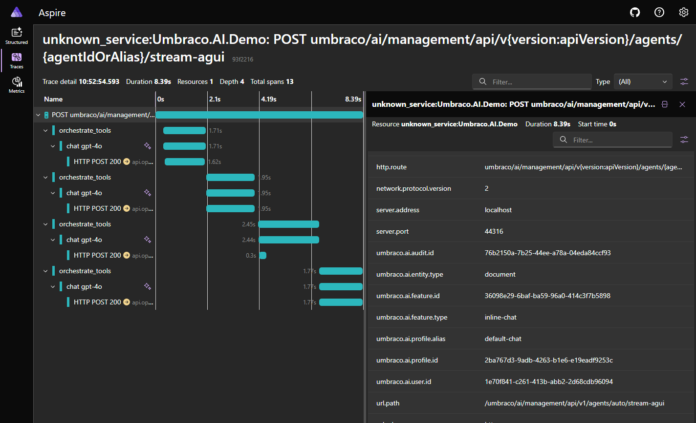

# Observability

Umbraco.AI provides built-in OpenTelemetry support for tracing and metrics. When configured, every AI operation emits distributed traces and performance metrics that integrate with your existing monitoring infrastructure.

## How It Works

Umbraco.AI builds on Microsoft.Extensions.AI (M.E.AI), which emits standard `gen_ai.*` spans and metrics defined by the OpenTelemetry Semantic Conventions. Umbraco.AI enriches these spans with CMS-specific context like which profile, prompt, or agent initiated the operation.

```
Request → [Middleware Pipeline] → Provider
                ↓                     ↓
         Umbraco tags added     gen_ai.* span created
                ↓
         Application Performance Monitoring (APM) dashboard (Jaeger, Application Insights, etc.)
```

## Enabling OpenTelemetry

Register the Umbraco.AI source name in your OpenTelemetry configuration:



```csharp
using Umbraco.AI.Core.Telemetry;

builder.Services.AddOpenTelemetry()
    .WithTracing(t => t.AddSource(AITelemetry.SourceName))
    .WithMetrics(m => m.AddMeter(AITelemetry.SourceName));
```



The source name is `"Umbraco.AI"`, exposed as the constant `AITelemetry.SourceName`.


When OpenTelemetry is not configured, there is zero overhead. The M.E.AI middleware short-circuits before any recording happens.


## Traces

Each AI operation creates a span following the OpenTelemetry `gen_ai` semantic conventions:

| Span Name | Kind | Description |
| --- | --- | --- |
| `gen_ai.chat {model}` | Client | Chat completion request |
| `gen_ai.embeddings {model}` | Client | Embedding generation request |

### Umbraco Enrichment Tags

Beyond the standard `gen_ai.*` attributes, Umbraco.AI adds context-specific tags:

| Tag | Description |
| --- | --- |
| `umbraco.ai.profile.id` | AI profile GUID |
| `umbraco.ai.profile.alias` | AI profile alias |
| `umbraco.ai.entity.id` | CMS entity ID the operation targets |
| `umbraco.ai.entity.type` | CMS entity type (document, media, etc.) |
| `umbraco.ai.feature.type` | Feature that initiated the call (prompt, agent, etc.) |
| `umbraco.ai.feature.id` | Specific prompt or agent ID |
| `umbraco.ai.audit.id` | Linked audit log entry ID |
| `umbraco.ai.user.id` | Umbraco user who initiated the operation |

These tags are available as constants in `AITelemetry.Tags`.

## Metrics

M.E.AI automatically emits the following metrics:

| Metric | Type | Description |
| --- | --- | --- |
| `gen_ai.client.token.usage` | Histogram | Input and output token counts |
| `gen_ai.client.operation.duration` | Histogram | Operation latency |
| `gen_ai.client.time_to_first_chunk` | Histogram | Time to first streaming chunk |
| `gen_ai.client.time_per_output_chunk` | Histogram | Per-chunk streaming latency |

## Audit Log Correlation

When both OpenTelemetry and audit logging are enabled, audit log entries include a `TraceId` property. This allows you to:

- Navigate from an audit record to the full distributed trace in your APM dashboard
- Find the audit record for a specific trace
- Correlate AI usage data with infrastructure performance data

## Example: Application Insights



```csharp
using Umbraco.AI.Core.Telemetry;

builder.Services.AddOpenTelemetry()
    .WithTracing(t => t
        .AddSource(AITelemetry.SourceName)
        .AddAzureMonitorTraceExporter())
    .WithMetrics(m => m
        .AddMeter(AITelemetry.SourceName)
        .AddAzureMonitorMetricExporter());
```





## Example: Jaeger



```csharp
using Umbraco.AI.Core.Telemetry;

builder.Services.AddOpenTelemetry()
    .WithTracing(t => t
        .AddSource(AITelemetry.SourceName)
        .AddOtlpExporter());
```



## Related

- [Middleware](middleware.md) - How the pipeline processes requests
- [Audit Logs](../backoffice/audit-logs.md) - Audit logging with trace correlation
