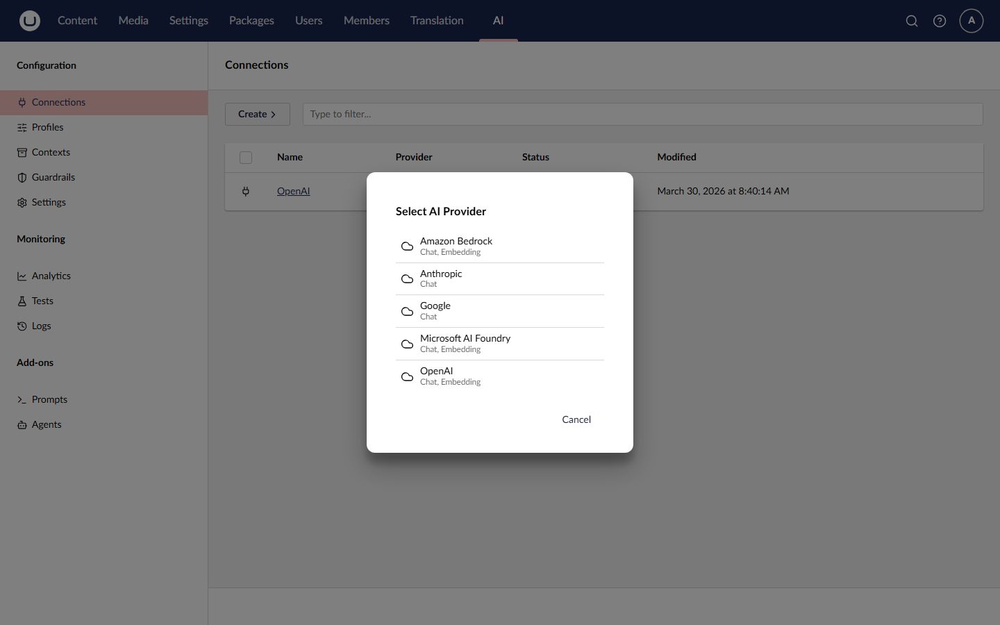
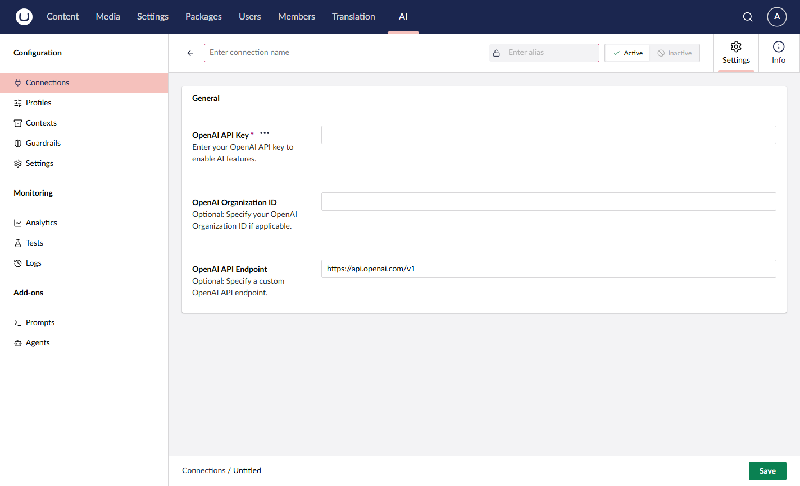

# Your First Connection

A connection stores the credentials and settings needed to communicate with an AI provider. Before you can use AI features, you need to create at least one connection.

## Prerequisites

- Umbraco.AI and a provider package installed
- An API key from your AI provider

## Create a Connection

1. Log in to the Umbraco backoffice
2. Navigate to the **AI** section
3. Click **Connections** in the tree
4. Click **Create Connection**


If you don't see the AI section, ensure your user group has access to it. See the [Installation](installation.md#verify-installation) guide for details on granting section access.


## Configure the Connection

Fill in the connection details:

| Field        | Description                                 | Example                      |
| ------------ | ------------------------------------------- | ---------------------------- |
| **Name**     | A display name for this connection          | "OpenAI Production"          |
| **Alias**    | A unique identifier for programmatic access | "openai-prod"                |
| **Provider** | The AI provider to use                      | "OpenAI"                     |
| **API Key**  | Your provider API key                       | "sk-..." or "$OpenAI:ApiKey" |


Use a configuration reference like `$OpenAI:ApiKey` to read the API key from `appsettings.json` instead of storing it in the database.


## Connection Properties

Each connection has the following properties:

| Property     | Description                                               |
| ------------ | --------------------------------------------------------- |
| `Id`         | Unique GUID identifier                                    |
| `Alias`      | Unique string alias for lookups                           |
| `Name`       | Display name                                              |
| `ProviderId` | Which provider this connection uses                       |
| `Settings`   | Provider-specific settings (API key, endpoint, and so on) |
| `IsActive`   | Whether the connection is enabled                         |

## Multiple Connections

You can create multiple connections to:

- Separate development and production environments
- Use different API keys for different teams or projects
- Connect to multiple AI providers

## Next Steps


[Your First Profile](first-profile.md)

