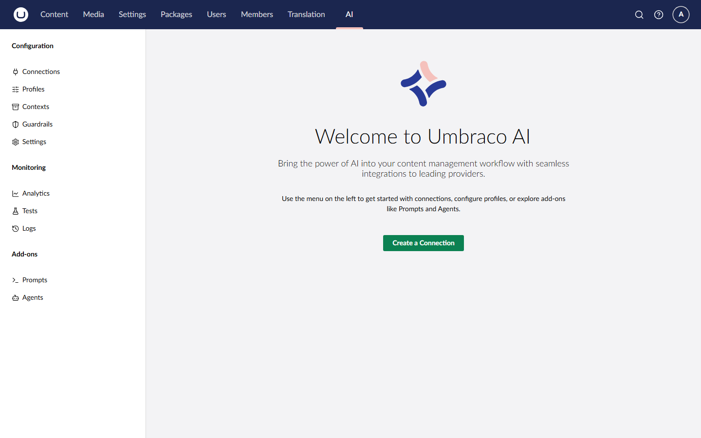
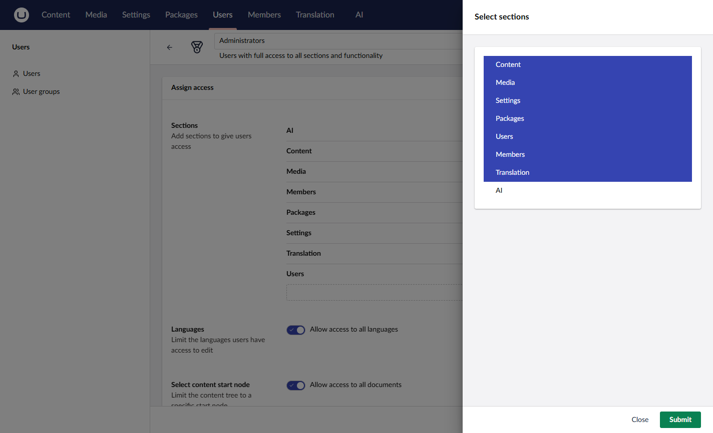

# Installation

Umbraco.AI is distributed as NuGet packages. You need to install the core package and at least one provider package.

## Install the Core Package

Add the Umbraco.AI package to your Umbraco project:



```powershell
Install-Package Umbraco.AI
```



Or using the .NET CLI:



```bash
dotnet add package Umbraco.AI
```



## Install a Provider Package

Umbraco.AI requires at least one provider to connect to AI services. Install the provider for your preferred AI service.

### OpenAI



```bash
dotnet add package Umbraco.AI.OpenAI
```




Additional providers will be available in future releases. You can also create custom providers for other AI services.


## Package Contents

The packages install the following components:

| Package             | Contents                                                          |
| ------------------- | ----------------------------------------------------------------- |
| `Umbraco.AI`        | Core services, backoffice UI, Management API, database migrations |
| `Umbraco.AI.OpenAI` | OpenAI provider with chat and embedding capabilities              |

## Verify Installation

After installation, build your project:



```bash
dotnet build
```



When you run your Umbraco site, a new **AI** section will appear in the backoffice.




**User Permissions**: The AI section is a standalone section in the backoffice. You may need to grant your user group access to the AI section:
1. Navigate to **Users** > **User Groups**
2. Edit the relevant user group (for example, Administrators)
3. Enable **AI** in the **Sections** list
4. Save the user group
5. Refresh your browser to see the AI section




## Next Steps


[Your First Connection](first-connection.md)

