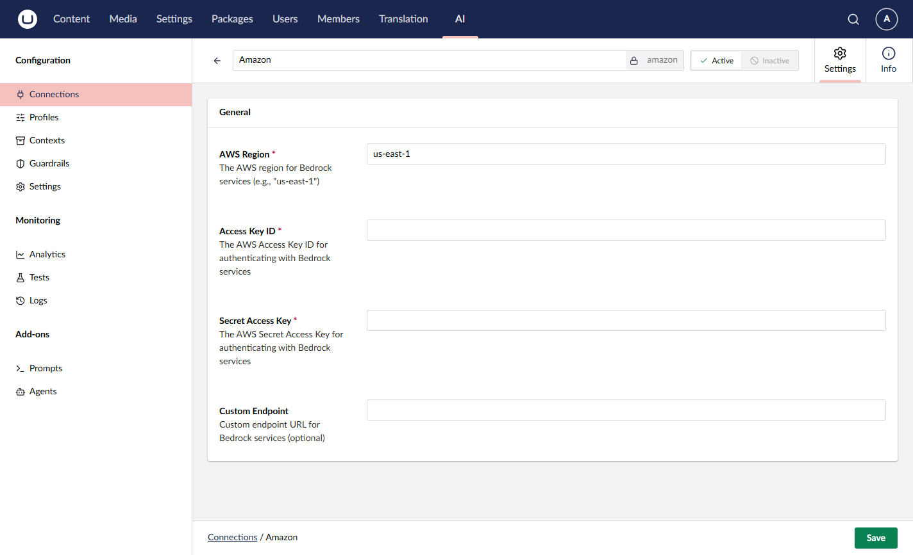

# Amazon Bedrock

Amazon Bedrock provides access to multiple AI models from Amazon, Anthropic, Meta, Mistral, and others through AWS infrastructure, supporting both Chat and Embedding capabilities.

## Installation



```powershell
Install-Package Umbraco.AI.Amazon
```



Or via .NET CLI:



```bash
dotnet add package Umbraco.AI.Amazon
```



## Connection Settings

| Setting           | Required | Description                             |
| ----------------- | -------- | --------------------------------------- |
| Region            | Yes      | AWS region (e.g., `us-east-1`)          |
| Access Key ID     | Yes      | Your AWS access key ID                  |
| Secret Access Key | Yes      | Your AWS secret access key              |
| Endpoint          | No       | Custom endpoint URL (for VPC endpoints) |

### Getting AWS Credentials

1. Sign in to the [AWS Console](https://console.aws.amazon.com)
2. Navigate to **IAM** > **Users**
3. Create or select a user
4. Create an access key under **Security credentials**
5. Copy the Access Key ID and Secret Access Key


Use IAM roles with least-privilege permissions. The user needs `bedrock:InvokeModel` permission.


### Required IAM Policy



```json
{
    "Version": "2012-10-17",
    "Statement": [
        {
            "Effect": "Allow",
            "Action": ["bedrock:InvokeModel", "bedrock:InvokeModelWithResponseStream"],
            "Resource": "arn:aws:bedrock:*::foundation-model/*"
        }
    ]
}
```



### Enabling Models

Before using a model, you must enable it in your AWS account:

1. Go to **Amazon Bedrock** in the AWS Console
2. Navigate to **Model access**
3. Click **Manage model access**
4. Select the models you want to use
5. Submit the request (some models require approval)



## Related

- [Providers Overview](README.md)
- [Managing Connections](../backoffice/managing-connections.md)
