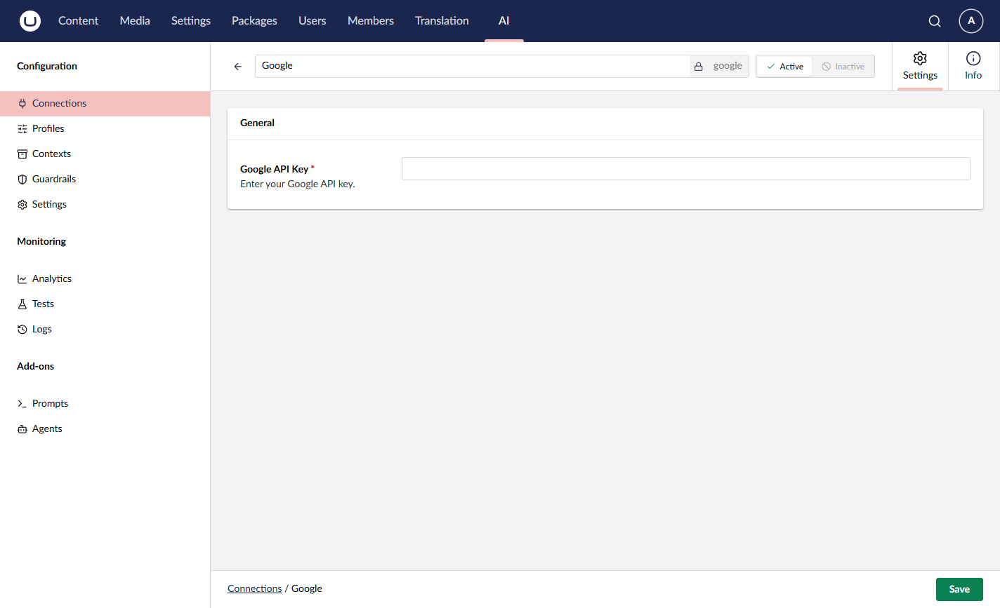

# Google Gemini

Google Gemini provides access to Google's latest AI models with native multimodal capabilities.

## Installation



```powershell
Install-Package Umbraco.AI.Google
```



Or via .NET CLI:



```bash
dotnet add package Umbraco.AI.Google
```



## Capabilities

| Capability | Supported | Description                           |
| ---------- | --------- | ------------------------------------- |
| Chat       | Yes       | Gemini 2.0, Gemini 1.5 model families |
| Embedding  | No        | Not currently supported               |

## Connection Settings

| Setting | Required | Description                                                          |
| ------- | -------- | -------------------------------------------------------------------- |
| API Key | Yes      | Your Google AI API key from [AI Studio](https://aistudio.google.com) |

### Getting an API Key

1. Go to [Google AI Studio](https://aistudio.google.com)
2. Sign in with your Google account
3. Click **Get API key** in the sidebar
4. Create a new API key or use an existing one
5. Copy the key


Keep your API key secure. Never commit it to source control or expose it in client-side code.


## Available Models

| Model                   | Context Window | Best For                        |
| ----------------------- | -------------- | ------------------------------- |
| `gemini-2.0-flash`      | 1M             | Latest, best performance        |
| `gemini-2.0-flash-lite` | 1M             | Cost-optimized, fast            |
| `gemini-1.5-pro`        | 2M             | Complex reasoning, long context |
| `gemini-1.5-flash`      | 1M             | Balanced speed and quality      |
| `gemini-1.5-flash-8b`   | 1M             | Most cost-effective             |


Gemini 1.5 Pro has a 2 million token context window, ideal for processing entire codebases or book-length documents.


## Creating a Connection

### Via Backoffice

1. Navigate to the **AI** section > **Connections**
2. Click **Create Connection**
3. Select **Google** as the provider
4. Enter your API key
5. Save the connection



### Via Code



```csharp
var connection = new AIConnection
{
    Alias = "google-production",
    Name = "Google Production",
    ProviderId = "google",
    Settings = new GoogleProviderSettings
    {
        ApiKey = "AIza..."
    }
};

await _connectionService.SaveConnectionAsync(connection);
```



## Creating a Profile



```csharp
var profile = new AIProfile
{
    Alias = "gemini-assistant",
    Name = "Gemini Assistant",
    Capability = AICapability.Chat,
    ConnectionId = connectionId,
    Model = new AIModelRef("google", "gemini-2.0-flash"),
    Settings = new AIChatProfileSettings
    {
        Temperature = 0.7f,
        MaxTokens = 8192,
        SystemPromptTemplate = "You are a helpful assistant."
    }
};

await _profileService.SaveProfileAsync(profile);
```



## Gemini-Specific Features

### Extended Context Window

Gemini 1.5 Pro's 2M token context is exceptional for:

- Processing entire codebases
- Analyzing book-length documents
- Long-running conversations with full history

### Cost Efficiency

Gemini Flash models offer strong performance at lower cost:



```csharp
// Use Flash for high-volume, cost-sensitive operations
var costEfficientProfile = new AIProfile
{
    Alias = "gemini-budget",
    Name = "Gemini Budget",
    Capability = AICapability.Chat,
    ConnectionId = connectionId,
    Model = new AIModelRef("google", "gemini-1.5-flash-8b"),
    Settings = new AIChatProfileSettings
    {
        Temperature = 0.5f,
        MaxTokens = 1024
    }
};
```



## Pricing Considerations

Google Gemini uses pay-per-token pricing:

| Model               | Input (1M tokens) | Output (1M tokens) |
| ------------------- | ----------------- | ------------------ |
| Gemini 2.0 Flash    | ~$0.10            | ~$0.40             |
| Gemini 1.5 Pro      | ~$1.25            | ~$5.00             |
| Gemini 1.5 Flash    | ~$0.075           | ~$0.30             |
| Gemini 1.5 Flash-8B | ~$0.0375          | ~$0.15             |


Prices are approximate and subject to change. Check [Google AI pricing](https://ai.google.dev/pricing) for current rates.


## Troubleshooting

### Invalid API Key


```
Error: API key not valid
```


Verify your API key is correct and hasn't been revoked or restricted.

### Model Not Available


```
Error: Model not found
```


Some models may have regional restrictions or require specific account access.

### Rate Limits


```
Error: Resource exhausted
```


Google has rate limits based on your account. Consider:

- Implementing retry logic with exponential backoff
- Requesting quota increases through Google Cloud Console
- Using Flash models for high-volume operations

## Related

- [Providers Overview](README.md) - Compare all providers
- [Connections](../concepts/connections.md) - Managing credentials
- [Profiles](../concepts/profiles.md) - Configuring models
