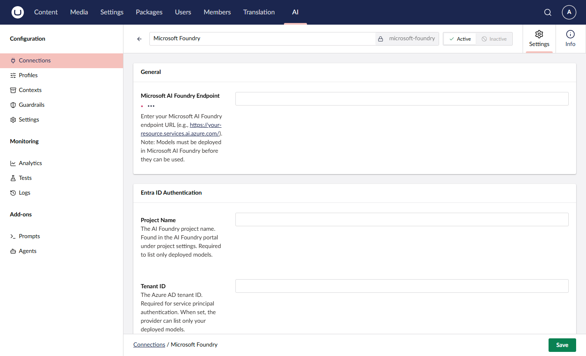

# Microsoft AI Foundry

Microsoft AI Foundry (formerly Azure AI Studio) provides a unified endpoint for accessing multiple AI models within the Azure ecosystem, supporting both Chat and Embedding capabilities.

## Installation



```powershell
Install-Package Umbraco.AI.MicrosoftFoundry
```



Or via .NET CLI:



```bash
dotnet add package Umbraco.AI.MicrosoftFoundry
```



## Connection Settings

The provider supports two authentication methods: **Entra ID** (recommended) and **API Key** (legacy).

### Entra ID Authentication (Recommended)

| Setting        | Required | Description                                              |
| -------------- | -------- | -------------------------------------------------------- |
| Endpoint       | Yes      | Your AI Foundry endpoint URL                             |
| Project Name   | No       | AI Foundry project name (enables deployed model listing) |
| Tenant ID      | No       | Microsoft Entra ID tenant ID                             |
| Client ID      | No       | Service principal application (client) ID                |
| Client Secret  | No       | Service principal secret                                 |

Entra ID supports two modes:

- **Service Principal** - Provide Tenant ID, Client ID, and Client Secret for explicit credentials
- **Managed Identity** - Provide only Tenant ID (or leave all Microsoft Entra ID fields empty) to use `DefaultAzureCredential`. This supports managed identities, Azure CLI, and other automatic credential sources


When using Microsoft Entra ID with a Project Name, the model picker shows only models deployed in your project. It does not display the full catalog.


### API Key Authentication (Legacy)

| Setting  | Required | Description                  |
| -------- | -------- | ---------------------------- |
| Endpoint | Yes      | Your AI Foundry endpoint URL |
| API Key  | Yes      | Your AI Foundry API key      |

### Getting Your Credentials

#### For Entra ID

1. Sign in to [Azure AI Studio](https://ai.azure.com)
2. Open your AI project
3. Copy the **Project Name** and **Endpoint** from the project overview
4. Create a service principal in **Microsoft Entra ID** > **App registrations**
5. Grant the **Azure AI Developer** role to the service principal on your AI Hub resource

#### For API Key

1. Sign in to [Azure AI Studio](https://ai.azure.com)
2. Open your AI project
3. Navigate to **Deployments**
4. Select your deployment
5. Copy the **Target URI** (endpoint) and **Key**


Keep credentials secure. Never commit API keys or client secrets to source control.




## Related

- [Providers Overview](README.md)
- [Managing Connections](../backoffice/managing-connections.md)
